

  

# 🤖 AI TrendHub – The Pulse of Artificial Intelligence

> 💡 **Specializing in AI:** This dashboard focuses exclusively on the rapidly evolving AI ecosystem, tracking the most impactful projects across engines, agents, and generative tools.

---

### 🔍 Search

- **In this README:** Use <kbd>Ctrl</kbd>+<kbd>F</kbd> (Windows/Linux) or <kbd>Cmd</kbd>+<kbd>F</kbd> (Mac) to find repos or section names.
- **From the terminal:** Run <code>python3 -m GitTrendHub.cli search "keyword"</code> from the repo root (e.g. <code>python3 -m GitTrendHub.cli search llama</code>). Requires a recent run of <code>python3 update_readme.py</code> to generate the index.

---

<h2 id='contents'>📑 Table of Contents</h2>

| # | Section | Repos | What you'll find |
|:--:|---|:--:|---|
| 1 | [🤖 LLM Engines & Platforms](#llm_engines) | 50 | Local and cloud LLM runtimes, inference servers, open-source model launchers |
| 2 | [🛠️ AI Agents & Orchestration](#agents) | 50 | Autonomous agents, multi-agent orchestration, browser and tool integration |
| 3 | [💻 AI-Powered CLI & DevTools](#cli_tools) | 50 | AI pair programming in terminal and IDE, code automation, CLI tools |
| 4 | [🎨 Generative Art & Vision](#art_vision) | 3 | Image and video generation, diffusion models, generative AI UI and APIs |
| 5 | [🧠 Research & Core Frameworks](#frameworks) | 2 | ML/NLP frameworks, agent platforms, research-grade core libraries |

**Other Sections**
- 6. [🤝 Community & Participation](#how-to-contribute) — How to contribute, PR guide, community
- 7. [🌐 AI Resource Navigator](#ai-resource-navigator) — Curated links: trends, news, tool discovery
- 8. [📝 Data Summary](#data-summary) — Data source and last generated timestamp

<h2 id='llm_engines'>🤖 LLM Engines & Platforms</h2>

 Section color

<table width="100%" cellpadding="0" cellspacing="0">
  <tr>
    <td width="58%" valign="top">
      <h3><a href="https://github.com/vllm-project/vllm">vllm</a> (Vault Mode)</h3>
      <table cellpadding="0" cellspacing="0"><tr><td>A high-throughput and memory-efficient inference and serving</td></tr><tr><td>engine for LLMs</td></tr><tr><td>&nbsp;</td></tr></table>
    </td>
    <td width="42%" valign="top" align="center">
      
    </td>
  </tr>
</table>

<a href="#llm_engines"><kbd>🤖 Back to Section</kbd></a> · <a href="#contents"><kbd>📑 Contents</kbd></a>

<table width="100%" cellpadding="0" cellspacing="0">
  <tr>
    <td width="58%" valign="top">
      <h3><a href="https://github.com/ray-project/ray">ray</a> (Vault Mode)</h3>
      <table cellpadding="0" cellspacing="0"><tr><td>Ray is an AI compute engine. Ray consists of a core</td></tr><tr><td>distributed runtime and a set of AI Libraries for</td></tr><tr><td>accelerating ML workloads.</td></tr></table>
    </td>
    <td width="42%" valign="top" align="center">
      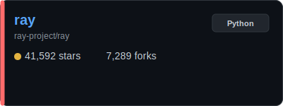
    </td>
  </tr>
</table>

<a href="#llm_engines"><kbd>🤖 Back to Section</kbd></a> · <a href="#contents"><kbd>📑 Contents</kbd></a>

<table width="100%" cellpadding="0" cellspacing="0">
  <tr>
    <td width="58%" valign="top">
      <h3><a href="https://github.com/labring/FastGPT">FastGPT</a> (Vault Mode)</h3>
      <table cellpadding="0" cellspacing="0"><tr><td>FastGPT is a knowledge-based platform built on the LLMs,</td></tr><tr><td>offers a comprehensive suite of out-of-the-box capabilities</td></tr><tr><td>such as data processing, RAG retrieval, and visual AI</td></tr></table>
    </td>
    <td width="42%" valign="top" align="center">
      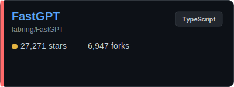
    </td>
  </tr>
</table>

<a href="#llm_engines"><kbd>🤖 Back to Section</kbd></a> · <a href="#contents"><kbd>📑 Contents</kbd></a>

<table width="100%" cellpadding="0" cellspacing="0">
  <tr>
    <td width="58%" valign="top">
      <h3><a href="https://github.com/sgl-project/sglang">sglang</a> (Vault Mode)</h3>
      <table cellpadding="0" cellspacing="0"><tr><td>SGLang is a high-performance serving framework for large</td></tr><tr><td>language models and multimodal models.</td></tr><tr><td>&nbsp;</td></tr></table>
    </td>
    <td width="42%" valign="top" align="center">
      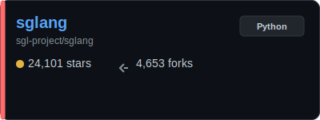
    </td>
  </tr>
</table>

<a href="#llm_engines"><kbd>🤖 Back to Section</kbd></a> · <a href="#contents"><kbd>📑 Contents</kbd></a>

<table width="100%" cellpadding="0" cellspacing="0">
  <tr>
    <td width="58%" valign="top">
      <h3><a href="https://github.com/mlc-ai/mlc-llm">mlc-llm</a> (Vault Mode)</h3>
      <table cellpadding="0" cellspacing="0"><tr><td>Universal LLM Deployment Engine with ML Compilation</td></tr><tr><td>&nbsp;</td></tr><tr><td>&nbsp;</td></tr></table>
    </td>
    <td width="42%" valign="top" align="center">
      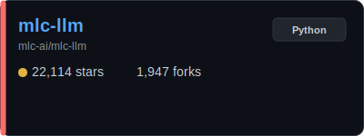
    </td>
  </tr>
</table>

<a href="#llm_engines"><kbd>🤖 Back to Section</kbd></a> · <a href="#contents"><kbd>📑 Contents</kbd></a>

<table width="100%" cellpadding="0" cellspacing="0">
  <tr>
    <td width="58%" valign="top">
      <h3><a href="https://github.com/google/adk-python">adk-python</a> (Vault Mode)</h3>
      <table cellpadding="0" cellspacing="0"><tr><td>An open-source, code-first Python toolkit for building,</td></tr><tr><td>evaluating, and deploying sophisticated AI agents with</td></tr><tr><td>flexibility and control.</td></tr></table>
    </td>
    <td width="42%" valign="top" align="center">
      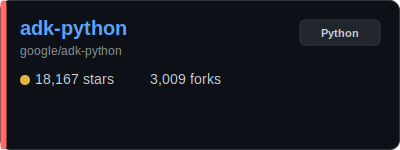
    </td>
  </tr>
</table>

<a href="#llm_engines"><kbd>🤖 Back to Section</kbd></a> · <a href="#contents"><kbd>📑 Contents</kbd></a>

<table width="100%" cellpadding="0" cellspacing="0">
  <tr>
    <td width="58%" valign="top">
      <h3><a href="https://github.com/botpress/botpress">botpress</a> (Vault Mode)</h3>
      <table cellpadding="0" cellspacing="0"><tr><td>The open-source hub to build & deploy GPT/LLM Agents ⚡️</td></tr><tr><td>&nbsp;</td></tr><tr><td>&nbsp;</td></tr></table>
    </td>
    <td width="42%" valign="top" align="center">
      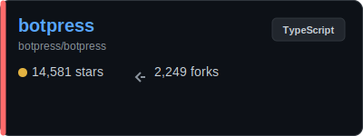
    </td>
  </tr>
</table>

<a href="#llm_engines"><kbd>🤖 Back to Section</kbd></a> · <a href="#contents"><kbd>📑 Contents</kbd></a>

<table width="100%" cellpadding="0" cellspacing="0">
  <tr>
    <td width="58%" valign="top">
      <h3><a href="https://github.com/Lightning-AI/litgpt">litgpt</a> (Vault Mode)</h3>
      <table cellpadding="0" cellspacing="0"><tr><td>20+ high-performance LLMs with recipes to pretrain, finetune</td></tr><tr><td>and deploy at scale.</td></tr><tr><td>&nbsp;</td></tr></table>
    </td>
    <td width="42%" valign="top" align="center">
      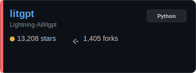
    </td>
  </tr>
</table>

<a href="#llm_engines"><kbd>🤖 Back to Section</kbd></a> · <a href="#contents"><kbd>📑 Contents</kbd></a>

<table width="100%" cellpadding="0" cellspacing="0">
  <tr>
    <td width="58%" valign="top">
      <h3><a href="https://github.com/NVIDIA/TensorRT-LLM">TensorRT-LLM</a> (Vault Mode)</h3>
      <table cellpadding="0" cellspacing="0"><tr><td>TensorRT LLM provides users with an easy-to-use Python API</td></tr><tr><td>to define Large Language Models (LLMs) and supports</td></tr><tr><td>state-of-the-art optimizations to perform inference</td></tr></table>
    </td>
    <td width="42%" valign="top" align="center">
      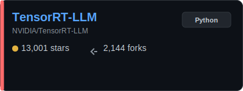
    </td>
  </tr>
</table>

<a href="#llm_engines"><kbd>🤖 Back to Section</kbd></a> · <a href="#contents"><kbd>📑 Contents</kbd></a>

<table width="100%" cellpadding="0" cellspacing="0">
  <tr>
    <td width="58%" valign="top">
      <h3><a href="https://github.com/microsoft/promptflow">promptflow</a> (Vault Mode)</h3>
      <table cellpadding="0" cellspacing="0"><tr><td>Build high-quality LLM apps - from prototyping, testing to</td></tr><tr><td>production deployment and monitoring.</td></tr><tr><td>&nbsp;</td></tr></table>
    </td>
    <td width="42%" valign="top" align="center">
      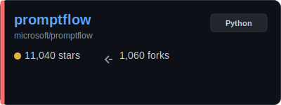
    </td>
  </tr>
</table>

<a href="#llm_engines"><kbd>🤖 Back to Section</kbd></a> · <a href="#contents"><kbd>📑 Contents</kbd></a>

<table width="100%" cellpadding="0" cellspacing="0">
  <tr>
    <td width="58%" valign="top">
      <h3><a href="https://github.com/Netflix/metaflow">metaflow</a> (Vault Mode)</h3>
      <table cellpadding="0" cellspacing="0"><tr><td>Build, Manage and Deploy AI/ML Systems</td></tr><tr><td>&nbsp;</td></tr><tr><td>&nbsp;</td></tr></table>
    </td>
    <td width="42%" valign="top" align="center">
      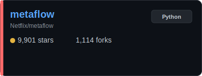
    </td>
  </tr>
</table>

<a href="#llm_engines"><kbd>🤖 Back to Section</kbd></a> · <a href="#contents"><kbd>📑 Contents</kbd></a>

<table width="100%" cellpadding="0" cellspacing="0">
  <tr>
    <td width="58%" valign="top">
      <h3><a href="https://github.com/krillinai/KrillinAI">KrillinAI</a> (Vault Mode)</h3>
      <table cellpadding="0" cellspacing="0"><tr><td>Video translation and dubbing tool powered by LLMs. The</td></tr><tr><td>video translator offers 100 language translations and</td></tr><tr><td>one-click full-process deployment. The video translation</td></tr></table>
    </td>
    <td width="42%" valign="top" align="center">
      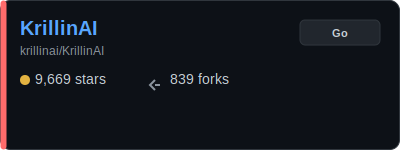
    </td>
  </tr>
</table>

<a href="#llm_engines"><kbd>🤖 Back to Section</kbd></a> · <a href="#contents"><kbd>📑 Contents</kbd></a>

<table width="100%" cellpadding="0" cellspacing="0">
  <tr>
    <td width="58%" valign="top">
      <h3><a href="https://github.com/xorbitsai/inference">inference</a> (Vault Mode)</h3>
      <table cellpadding="0" cellspacing="0"><tr><td>Swap GPT for any LLM by changing a single line of code.</td></tr><tr><td>Xinference lets you run open-source, speech, and multimodal</td></tr><tr><td>models on cloud, on-prem, or your laptop — all through one</td></tr></table>
    </td>
    <td width="42%" valign="top" align="center">
      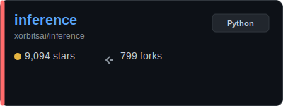
    </td>
  </tr>
</table>

<a href="#llm_engines"><kbd>🤖 Back to Section</kbd></a> · <a href="#contents"><kbd>📑 Contents</kbd></a>

<table width="100%" cellpadding="0" cellspacing="0">
  <tr>
    <td width="58%" valign="top">
      <h3><a href="https://github.com/oumi-ai/oumi">oumi</a> (Vault Mode)</h3>
      <table cellpadding="0" cellspacing="0"><tr><td>Easily fine-tune, evaluate and deploy gpt-oss, Qwen3,</td></tr><tr><td>DeepSeek-R1, or any open source LLM / VLM!</td></tr><tr><td>&nbsp;</td></tr></table>
    </td>
    <td width="42%" valign="top" align="center">
      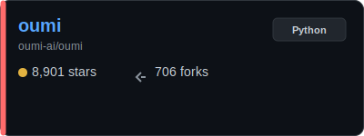
    </td>
  </tr>
</table>

<a href="#llm_engines"><kbd>🤖 Back to Section</kbd></a> · <a href="#contents"><kbd>📑 Contents</kbd></a>

<table width="100%" cellpadding="0" cellspacing="0">
  <tr>
    <td width="58%" valign="top">
      <h3><a href="https://github.com/Tiiny-AI/PowerInfer">PowerInfer</a> (Vault Mode)</h3>
      <table cellpadding="0" cellspacing="0"><tr><td>High-speed Large Language Model Serving for Local Deployment</td></tr><tr><td>&nbsp;</td></tr><tr><td>&nbsp;</td></tr></table>
    </td>
    <td width="42%" valign="top" align="center">
      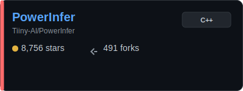
    </td>
  </tr>
</table>

<a href="#llm_engines"><kbd>🤖 Back to Section</kbd></a> · <a href="#contents"><kbd>📑 Contents</kbd></a>

<table width="100%" cellpadding="0" cellspacing="0">
  <tr>
    <td width="58%" valign="top">
      <h3><a href="https://github.com/NexaAI/nexa-sdk">nexa-sdk</a> (Vault Mode)</h3>
      <table cellpadding="0" cellspacing="0"><tr><td>Run frontier LLMs and VLMs with day-0 model support across</td></tr><tr><td>GPU, NPU, and CPU, with comprehensive runtime coverage for</td></tr><tr><td>PC (Python/C++), mobile (Android & iOS), and Linux/IoT</td></tr></table>
    </td>
    <td width="42%" valign="top" align="center">
      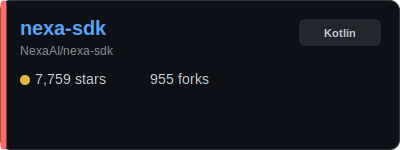
    </td>
  </tr>
</table>

<a href="#llm_engines"><kbd>🤖 Back to Section</kbd></a> · <a href="#contents"><kbd>📑 Contents</kbd></a>

<table width="100%" cellpadding="0" cellspacing="0">
  <tr>
    <td width="58%" valign="top">
      <h3><a href="https://github.com/InternLM/lmdeploy">lmdeploy</a> (Vault Mode)</h3>
      <table cellpadding="0" cellspacing="0"><tr><td>LMDeploy is a toolkit for compressing, deploying, and</td></tr><tr><td>serving LLMs.</td></tr><tr><td>&nbsp;</td></tr></table>
    </td>
    <td width="42%" valign="top" align="center">
      
    </td>
  </tr>
</table>

<a href="#llm_engines"><kbd>🤖 Back to Section</kbd></a> · <a href="#contents"><kbd>📑 Contents</kbd></a>

<table width="100%" cellpadding="0" cellspacing="0">
  <tr>
    <td width="58%" valign="top">
      <h3><a href="https://github.com/google/adk-go">adk-go</a> (Vault Mode)</h3>
      <table cellpadding="0" cellspacing="0"><tr><td>An open-source, code-first Go toolkit for building,</td></tr><tr><td>evaluating, and deploying sophisticated AI agents with</td></tr><tr><td>flexibility and control.</td></tr></table>
    </td>
    <td width="42%" valign="top" align="center">
      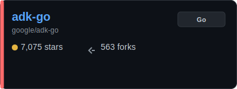
    </td>
  </tr>
</table>

<a href="#llm_engines"><kbd>🤖 Back to Section</kbd></a> · <a href="#contents"><kbd>📑 Contents</kbd></a>

<table width="100%" cellpadding="0" cellspacing="0">
  <tr>
    <td width="58%" valign="top">
      <h3><a href="https://github.com/julep-ai/julep">julep</a> (Vault Mode)</h3>
      <table cellpadding="0" cellspacing="0"><tr><td>Deploy serverless AI workflows at scale. Firebase for AI</td></tr><tr><td>agents</td></tr><tr><td>&nbsp;</td></tr></table>
    </td>
    <td width="42%" valign="top" align="center">
      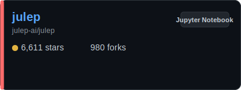
    </td>
  </tr>
</table>

<a href="#llm_engines"><kbd>🤖 Back to Section</kbd></a> · <a href="#contents"><kbd>📑 Contents</kbd></a>

<table width="100%" cellpadding="0" cellspacing="0">
  <tr>
    <td width="58%" valign="top">
      <h3><a href="https://github.com/Zipstack/unstract">unstract</a> (Vault Mode)</h3>
      <table cellpadding="0" cellspacing="0"><tr><td>LLM-Driven Extraction of Unstructured Data — Built for API</td></tr><tr><td>Deployments & ETL Pipeline Workflows</td></tr><tr><td>&nbsp;</td></tr></table>
    </td>
    <td width="42%" valign="top" align="center">
      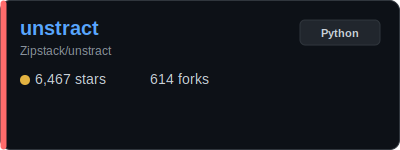
    </td>
  </tr>
</table>

<a href="#llm_engines"><kbd>🤖 Back to Section</kbd></a> · <a href="#contents"><kbd>📑 Contents</kbd></a>

<table width="100%" cellpadding="0" cellspacing="0">
  <tr>
    <td width="58%" valign="top">
      <h3><a href="https://github.com/PacktPublishing/LLM-Engineers-Handbook">LLM-Engineers-Handbook</a> (Vault Mode)</h3>
      <table cellpadding="0" cellspacing="0"><tr><td>The LLM's practical guide: From the fundamentals to</td></tr><tr><td>deploying advanced LLM and RAG apps to AWS using LLMOps best</td></tr><tr><td>practices</td></tr></table>
    </td>
    <td width="42%" valign="top" align="center">
      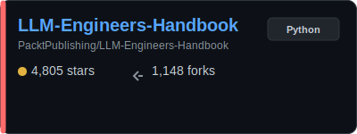
    </td>
  </tr>
</table>

<a href="#llm_engines"><kbd>🤖 Back to Section</kbd></a> · <a href="#contents"><kbd>📑 Contents</kbd></a>

<table width="100%" cellpadding="0" cellspacing="0">
  <tr>
    <td width="58%" valign="top">
      <h3><a href="https://github.com/osaurus-ai/osaurus">osaurus</a> (Vault Mode)</h3>
      <table cellpadding="0" cellspacing="0"><tr><td>AI edge infrastructure for macOS. Run local or cloud models,</td></tr><tr><td>share tools across apps via MCP, and power AI workflows with</td></tr><tr><td>a native, always-on runtime.</td></tr></table>
    </td>
    <td width="42%" valign="top" align="center">
      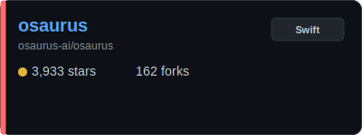
    </td>
  </tr>
</table>

<a href="#llm_engines"><kbd>🤖 Back to Section</kbd></a> · <a href="#contents"><kbd>📑 Contents</kbd></a>

<table width="100%" cellpadding="0" cellspacing="0">
  <tr>
    <td width="58%" valign="top">
      <h3><a href="https://github.com/ModelTC/LightLLM">LightLLM</a> (Vault Mode)</h3>
      <table cellpadding="0" cellspacing="0"><tr><td>LightLLM is a Python-based LLM (Large Language Model)</td></tr><tr><td>inference and serving framework, notable for its lightweight</td></tr><tr><td>design, easy scalability, and high-speed performance.</td></tr></table>
    </td>
    <td width="42%" valign="top" align="center">
      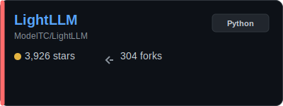
    </td>
  </tr>
</table>

<a href="#llm_engines"><kbd>🤖 Back to Section</kbd></a> · <a href="#contents"><kbd>📑 Contents</kbd></a>

<table width="100%" cellpadding="0" cellspacing="0">
  <tr>
    <td width="58%" valign="top">
      <h3><a href="https://github.com/PaddlePaddle/FastDeploy">FastDeploy</a> (Vault Mode)</h3>
      <table cellpadding="0" cellspacing="0"><tr><td>High-performance Inference and Deployment Toolkit for LLMs</td></tr><tr><td>and VLMs based on PaddlePaddle</td></tr><tr><td>&nbsp;</td></tr></table>
    </td>
    <td width="42%" valign="top" align="center">
      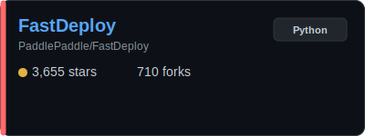
    </td>
  </tr>
</table>

<a href="#llm_engines"><kbd>🤖 Back to Section</kbd></a> · <a href="#contents"><kbd>📑 Contents</kbd></a>

<table width="100%" cellpadding="0" cellspacing="0">
  <tr>
    <td width="58%" valign="top">
      <h3><a href="https://github.com/NVIDIA/TransformerEngine">TransformerEngine</a> (Vault Mode)</h3>
      <table cellpadding="0" cellspacing="0"><tr><td>A library for accelerating Transformer models on NVIDIA</td></tr><tr><td>GPUs, including using 8-bit and 4-bit floating point (FP8</td></tr><tr><td>and FP4) precision on Hopper, Ada and Blackwell GPUs, to</td></tr></table>
    </td>
    <td width="42%" valign="top" align="center">
      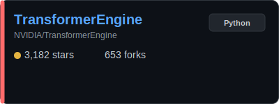
    </td>
  </tr>
</table>

<a href="#llm_engines"><kbd>🤖 Back to Section</kbd></a> · <a href="#contents"><kbd>📑 Contents</kbd></a>

<table width="100%" cellpadding="0" cellspacing="0">
  <tr>
    <td width="58%" valign="top">
      <h3><a href="https://github.com/Intelligent-Internet/ii-agent">ii-agent</a> (Vault Mode)</h3>
      <table cellpadding="0" cellspacing="0"><tr><td>II-Agent: a new open-source framework to build and deploy</td></tr><tr><td>intelligent agents</td></tr><tr><td>&nbsp;</td></tr></table>
    </td>
    <td width="42%" valign="top" align="center">
      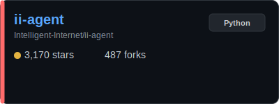
    </td>
  </tr>
</table>

<a href="#llm_engines"><kbd>🤖 Back to Section</kbd></a> · <a href="#contents"><kbd>📑 Contents</kbd></a>

<table width="100%" cellpadding="0" cellspacing="0">
  <tr>
    <td width="58%" valign="top">
      <h3><a href="https://github.com/vllm-project/llm-compressor">llm-compressor</a> (Vault Mode)</h3>
      <table cellpadding="0" cellspacing="0"><tr><td>Transformers-compatible library for applying various</td></tr><tr><td>compression algorithms to LLMs for optimized deployment with</td></tr><tr><td>vLLM</td></tr></table>
    </td>
    <td width="42%" valign="top" align="center">
      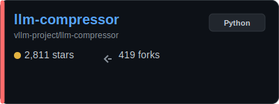
    </td>
  </tr>
</table>

<a href="#llm_engines"><kbd>🤖 Back to Section</kbd></a> · <a href="#contents"><kbd>📑 Contents</kbd></a>

<table width="100%" cellpadding="0" cellspacing="0">
  <tr>
    <td width="58%" valign="top">
      <h3><a href="https://github.com/michaelfeil/infinity">infinity</a> (Vault Mode)</h3>
      <table cellpadding="0" cellspacing="0"><tr><td>Infinity is a high-throughput, low-latency serving engine</td></tr><tr><td>for text-embeddings, reranking models, clip, clap and</td></tr><tr><td>colpali</td></tr></table>
    </td>
    <td width="42%" valign="top" align="center">
      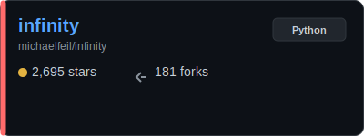
    </td>
  </tr>
</table>

<a href="#llm_engines"><kbd>🤖 Back to Section</kbd></a> · <a href="#contents"><kbd>📑 Contents</kbd></a>

<table width="100%" cellpadding="0" cellspacing="0">
  <tr>
    <td width="58%" valign="top">
      <h3><a href="https://github.com/OpenMind/OM1">OM1</a> (Vault Mode)</h3>
      <table cellpadding="0" cellspacing="0"><tr><td>Modular AI runtime for robots</td></tr><tr><td>&nbsp;</td></tr><tr><td>&nbsp;</td></tr></table>
    </td>
    <td width="42%" valign="top" align="center">
      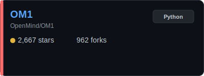
    </td>
  </tr>
</table>

<a href="#llm_engines"><kbd>🤖 Back to Section</kbd></a> · <a href="#contents"><kbd>📑 Contents</kbd></a>

<table width="100%" cellpadding="0" cellspacing="0">
  <tr>
    <td width="58%" valign="top">
      <h3><a href="https://github.com/containers/ramalama">ramalama</a> (Vault Mode)</h3>
      <table cellpadding="0" cellspacing="0"><tr><td>RamaLama is an open-source developer tool that simplifies</td></tr><tr><td>the local serving of AI models from any source and</td></tr><tr><td>facilitates their use for inference in production, all</td></tr></table>
    </td>
    <td width="42%" valign="top" align="center">
      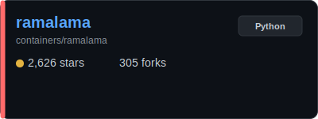
    </td>
  </tr>
</table>

<a href="#llm_engines"><kbd>🤖 Back to Section</kbd></a> · <a href="#contents"><kbd>📑 Contents</kbd></a>

<table width="100%" cellpadding="0" cellspacing="0">
  <tr>
    <td width="58%" valign="top">
      <h3><a href="https://github.com/xdit-project/xDiT">xDiT</a> (Vault Mode)</h3>
      <table cellpadding="0" cellspacing="0"><tr><td>xDiT: A Scalable Inference Engine for Diffusion Transformers</td></tr><tr><td>(DiTs) with Massive Parallelism</td></tr><tr><td>&nbsp;</td></tr></table>
    </td>
    <td width="42%" valign="top" align="center">
      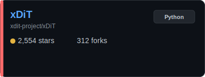
    </td>
  </tr>
</table>

<a href="#llm_engines"><kbd>🤖 Back to Section</kbd></a> · <a href="#contents"><kbd>📑 Contents</kbd></a>

<table width="100%" cellpadding="0" cellspacing="0">
  <tr>
    <td width="58%" valign="top">
      <h3><a href="https://github.com/langchain-ai/langserve">langserve</a> (Vault Mode)</h3>
      <table cellpadding="0" cellspacing="0"><tr><td>LangServe 🦜️🏓</td></tr><tr><td>&nbsp;</td></tr><tr><td>&nbsp;</td></tr></table>
    </td>
    <td width="42%" valign="top" align="center">
      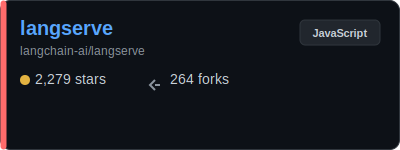
    </td>
  </tr>
</table>

<a href="#llm_engines"><kbd>🤖 Back to Section</kbd></a> · <a href="#contents"><kbd>📑 Contents</kbd></a>

<table width="100%" cellpadding="0" cellspacing="0">
  <tr>
    <td width="58%" valign="top">
      <h3><a href="https://github.com/NVIDIA/Model-Optimizer">Model-Optimizer</a> (Vault Mode)</h3>
      <table cellpadding="0" cellspacing="0"><tr><td>A unified library of SOTA model optimization techniques like</td></tr><tr><td>quantization, pruning, distillation, speculative decoding,</td></tr><tr><td>etc. It compresses deep learning models for downstream de...</td></tr></table>
    </td>
    <td width="42%" valign="top" align="center">
      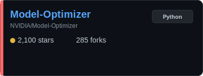
    </td>
  </tr>
</table>

<a href="#llm_engines"><kbd>🤖 Back to Section</kbd></a> · <a href="#contents"><kbd>📑 Contents</kbd></a>

<table width="100%" cellpadding="0" cellspacing="0">
  <tr>
    <td width="58%" valign="top">
      <h3><a href="https://github.com/run-llama/llama_deploy">llama_deploy</a> (Vault Mode)</h3>
      <table cellpadding="0" cellspacing="0"><tr><td>Deploy your agentic worfklows to production</td></tr><tr><td>&nbsp;</td></tr><tr><td>&nbsp;</td></tr></table>
    </td>
    <td width="42%" valign="top" align="center">
      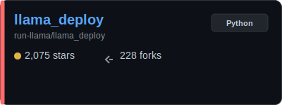
    </td>
  </tr>
</table>

<a href="#llm_engines"><kbd>🤖 Back to Section</kbd></a> · <a href="#contents"><kbd>📑 Contents</kbd></a>

<table width="100%" cellpadding="0" cellspacing="0">
  <tr>
    <td width="58%" valign="top">
      <h3><a href="https://github.com/nottelabs/notte">notte</a> (Vault Mode)</h3>
      <table cellpadding="0" cellspacing="0"><tr><td>🌸 Best framework to build web agents, and deploy serverless</td></tr><tr><td>web automation functions on reliable browser infra.</td></tr><tr><td>&nbsp;</td></tr></table>
    </td>
    <td width="42%" valign="top" align="center">
      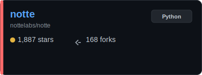
    </td>
  </tr>
</table>

<a href="#llm_engines"><kbd>🤖 Back to Section</kbd></a> · <a href="#contents"><kbd>📑 Contents</kbd></a>

<table width="100%" cellpadding="0" cellspacing="0">
  <tr>
    <td width="58%" valign="top">
      <h3><a href="https://github.com/google/adk-java">adk-java</a> (Vault Mode)</h3>
      <table cellpadding="0" cellspacing="0"><tr><td>An open-source, code-first Java toolkit for building,</td></tr><tr><td>evaluating, and deploying sophisticated AI agents with</td></tr><tr><td>flexibility and control.</td></tr></table>
    </td>
    <td width="42%" valign="top" align="center">
      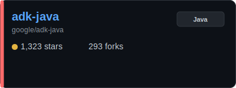
    </td>
  </tr>
</table>

<a href="#llm_engines"><kbd>🤖 Back to Section</kbd></a> · <a href="#contents"><kbd>📑 Contents</kbd></a>

<table width="100%" cellpadding="0" cellspacing="0">
  <tr>
    <td width="58%" valign="top">
      <h3><a href="https://github.com/BlackSnufkin/LitterBox">LitterBox</a> (Vault Mode)</h3>
      <table cellpadding="0" cellspacing="0"><tr><td>A secure sandbox environment for malware developers and red</td></tr><tr><td>teamers to test payloads against detection mechanisms before</td></tr><tr><td>deployment. Integrates with LLM agents via MCP for enhan...</td></tr></table>
    </td>
    <td width="42%" valign="top" align="center">
      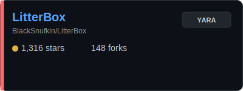
    </td>
  </tr>
</table>

<a href="#llm_engines"><kbd>🤖 Back to Section</kbd></a> · <a href="#contents"><kbd>📑 Contents</kbd></a>

<table width="100%" cellpadding="0" cellspacing="0">
  <tr>
    <td width="58%" valign="top">
      <h3><a href="https://github.com/SmythOS/sre">sre</a> (Vault Mode)</h3>
      <table cellpadding="0" cellspacing="0"><tr><td>The SmythOS Runtime Environment (SRE) is an open-source,</td></tr><tr><td>cloud-native runtime for agentic AI. Secure, modular, and</td></tr><tr><td>production-ready, it lets developers build, run, and manage</td></tr></table>
    </td>
    <td width="42%" valign="top" align="center">
      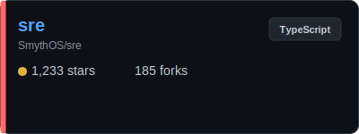
    </td>
  </tr>
</table>

<a href="#llm_engines"><kbd>🤖 Back to Section</kbd></a> · <a href="#contents"><kbd>📑 Contents</kbd></a>

<table width="100%" cellpadding="0" cellspacing="0">
  <tr>
    <td width="58%" valign="top">
      <h3><a href="https://github.com/GradientHQ/parallax">parallax</a> (Vault Mode)</h3>
      <table cellpadding="0" cellspacing="0"><tr><td>Parallax is a distributed model serving framework that lets</td></tr><tr><td>you build your own AI cluster anywhere</td></tr><tr><td>&nbsp;</td></tr></table>
    </td>
    <td width="42%" valign="top" align="center">
      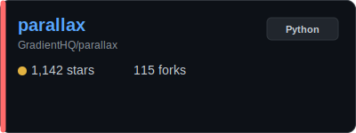
    </td>
  </tr>
</table>

<a href="#llm_engines"><kbd>🤖 Back to Section</kbd></a> · <a href="#contents"><kbd>📑 Contents</kbd></a>

<table width="100%" cellpadding="0" cellspacing="0">
  <tr>
    <td width="58%" valign="top">
      <h3><a href="https://github.com/google/adk-js">adk-js</a> (Vault Mode)</h3>
      <table cellpadding="0" cellspacing="0"><tr><td>An open-source, code-first Typescript toolkit for building,</td></tr><tr><td>evaluating, and deploying sophisticated AI agents with</td></tr><tr><td>flexibility and control.</td></tr></table>
    </td>
    <td width="42%" valign="top" align="center">
      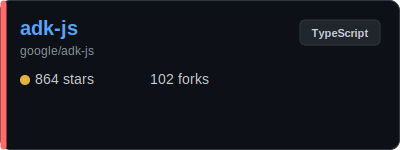
    </td>
  </tr>
</table>

<a href="#llm_engines"><kbd>🤖 Back to Section</kbd></a> · <a href="#contents"><kbd>📑 Contents</kbd></a>

<table width="100%" cellpadding="0" cellspacing="0">
  <tr>
    <td width="58%" valign="top">
      <h3><a href="https://github.com/docker/compose-for-agents">compose-for-agents</a> (Vault Mode)</h3>
      <table cellpadding="0" cellspacing="0"><tr><td>Build and run AI agents using Docker Compose. A collection</td></tr><tr><td>of ready-to-use examples for orchestrating open-source LLMs,</td></tr><tr><td>tools, and agent runtimes.</td></tr></table>
    </td>
    <td width="42%" valign="top" align="center">
      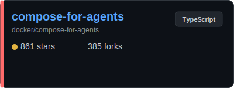
    </td>
  </tr>
</table>

<a href="#llm_engines"><kbd>🤖 Back to Section</kbd></a> · <a href="#contents"><kbd>📑 Contents</kbd></a>

<table width="100%" cellpadding="0" cellspacing="0">
  <tr>
    <td width="58%" valign="top">
      <h3><a href="https://github.com/xpander-ai/xpander.ai">xpander.ai</a> (Vault Mode)</h3>
      <table cellpadding="0" cellspacing="0"><tr><td>xpander.ai is the runtime and control plane to build, run,</td></tr><tr><td>and ship reliable AI agents fast and anywhere</td></tr><tr><td>&nbsp;</td></tr></table>
    </td>
    <td width="42%" valign="top" align="center">
      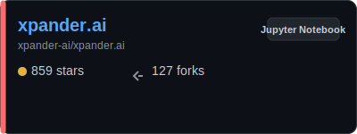
    </td>
  </tr>
</table>

<a href="#llm_engines"><kbd>🤖 Back to Section</kbd></a> · <a href="#contents"><kbd>📑 Contents</kbd></a>

<table width="100%" cellpadding="0" cellspacing="0">
  <tr>
    <td width="58%" valign="top">
      <h3><a href="https://github.com/kossakovsky/n8n-install">n8n-install</a> (Vault Mode)</h3>
      <table cellpadding="0" cellspacing="0"><tr><td>🚀 Self-hosted AI automation platform. Deploy n8n, Ollama,</td></tr><tr><td>Flowise, RAG, Supabase & 30+ tools with one command. Auto</td></tr><tr><td>HTTPS. Free Zapier/Make alternative.</td></tr></table>
    </td>
    <td width="42%" valign="top" align="center">
      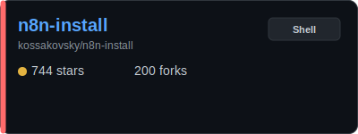
    </td>
  </tr>
</table>

<a href="#llm_engines"><kbd>🤖 Back to Section</kbd></a> · <a href="#contents"><kbd>📑 Contents</kbd></a>

<table width="100%" cellpadding="0" cellspacing="0">
  <tr>
    <td width="58%" valign="top">
      <h3><a href="https://github.com/sgl-project/SpecForge">SpecForge</a> (Vault Mode)</h3>
      <table cellpadding="0" cellspacing="0"><tr><td>Train speculative decoding models effortlessly and port them</td></tr><tr><td>smoothly to SGLang serving.</td></tr><tr><td>&nbsp;</td></tr></table>
    </td>
    <td width="42%" valign="top" align="center">
      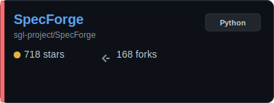
    </td>
  </tr>
</table>

<a href="#llm_engines"><kbd>🤖 Back to Section</kbd></a> · <a href="#contents"><kbd>📑 Contents</kbd></a>

<table width="100%" cellpadding="0" cellspacing="0">
  <tr>
    <td width="58%" valign="top">
      <h3><a href="https://github.com/tile-ai/TileRT">TileRT</a> (Vault Mode)</h3>
      <table cellpadding="0" cellspacing="0"><tr><td>Tile-Based Runtime for Ultra-Low-Latency LLM Inference</td></tr><tr><td>&nbsp;</td></tr><tr><td>&nbsp;</td></tr></table>
    </td>
    <td width="42%" valign="top" align="center">
      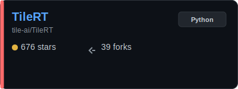
    </td>
  </tr>
</table>

<a href="#llm_engines"><kbd>🤖 Back to Section</kbd></a> · <a href="#contents"><kbd>📑 Contents</kbd></a>

<table width="100%" cellpadding="0" cellspacing="0">
  <tr>
    <td width="58%" valign="top">
      <h3><a href="https://github.com/Haohao-end/LMForge-End-to-End-LLMOps-Platform-for-Multi-Model-Agents">LMForge-End-to-End-LLMOps-Platform-for-Multi-Model-Agents</a> (Vault Mode)</h3>
      <table cellpadding="0" cellspacing="0"><tr><td>AI Agent Development Platform - Supports multiple models</td></tr><tr><td>(OpenAI/DeepSeek/Wenxin/Tongyi), knowledge base management,</td></tr><tr><td>workflow automation, and enterprise-grade security. Built</td></tr></table>
    </td>
    <td width="42%" valign="top" align="center">
      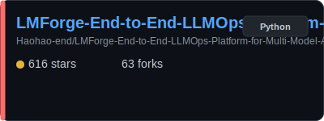
    </td>
  </tr>
</table>

<a href="#llm_engines"><kbd>🤖 Back to Section</kbd></a> · <a href="#contents"><kbd>📑 Contents</kbd></a>

<table width="100%" cellpadding="0" cellspacing="0">
  <tr>
    <td width="58%" valign="top">
      <h3><a href="https://github.com/alirezarezvani/claude-code-skill-factory">claude-code-skill-factory</a> (Vault Mode)</h3>
      <table cellpadding="0" cellspacing="0"><tr><td>Claude Code Skill Factory — A powerful open-source toolkit</td></tr><tr><td>for building and deploying production-ready Claude Skills,</td></tr><tr><td>Code Agents, custom Slash Commands, and LLM Prompts at</td></tr></table>
    </td>
    <td width="42%" valign="top" align="center">
      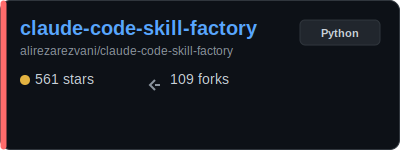
    </td>
  </tr>
</table>

<a href="#llm_engines"><kbd>🤖 Back to Section</kbd></a> · <a href="#contents"><kbd>📑 Contents</kbd></a>

<table width="100%" cellpadding="0" cellspacing="0">
  <tr>
    <td width="58%" valign="top">
      <h3><a href="https://github.com/yassa9/qwen600">qwen600</a> (Vault Mode)</h3>
      <table cellpadding="0" cellspacing="0"><tr><td>Static suckless single batch CUDA-only qwen3-0.6B mini</td></tr><tr><td>inference engine</td></tr><tr><td>&nbsp;</td></tr></table>
    </td>
    <td width="42%" valign="top" align="center">
      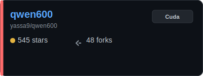
    </td>
  </tr>
</table>

<a href="#llm_engines"><kbd>🤖 Back to Section</kbd></a> · <a href="#contents"><kbd>📑 Contents</kbd></a>

<table width="100%" cellpadding="0" cellspacing="0">
  <tr>
    <td width="58%" valign="top">
      <h3><a href="https://github.com/waybarrios/vllm-mlx">vllm-mlx</a> (Vault Mode)</h3>
      <table cellpadding="0" cellspacing="0"><tr><td>OpenAI and Anthropic compatible server for Apple Silicon.</td></tr><tr><td>Run LLMs and vision-language models (Llama, Qwen-VL, LLaVA)</td></tr><tr><td>with continuous batching, MCP tool calling, and</td></tr></table>
    </td>
    <td width="42%" valign="top" align="center">
      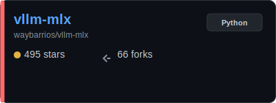
    </td>
  </tr>
</table>

<a href="#llm_engines"><kbd>🤖 Back to Section</kbd></a> · <a href="#contents"><kbd>📑 Contents</kbd></a>

<table width="100%" cellpadding="0" cellspacing="0">
  <tr>
    <td width="58%" valign="top">
      <h3><a href="https://github.com/milanm/AutoGrad-Engine">AutoGrad-Engine</a> (Vault Mode)</h3>
      <table cellpadding="0" cellspacing="0"><tr><td>A complete GPT language model (training and inference) in</td></tr><tr><td>~600 lines of pure C#, zero dependencies</td></tr><tr><td>&nbsp;</td></tr></table>
    </td>
    <td width="42%" valign="top" align="center">
      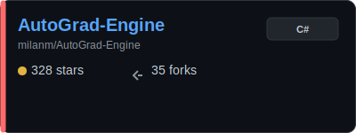
    </td>
  </tr>
</table>

<a href="#llm_engines"><kbd>🤖 Back to Section</kbd></a> · <a href="#contents"><kbd>📑 Contents</kbd></a>

---

<h2 id='agents'>🛠️ AI Agents & Orchestration</h2>

 Section color

<table width="100%" cellpadding="0" cellspacing="0">
  <tr>
    <td width="58%" valign="top">
      <h3><a href="https://github.com/langchain-ai/langchain">langchain</a> (Vault Mode)</h3>
      <table cellpadding="0" cellspacing="0"><tr><td>The agent engineering platform</td></tr><tr><td>&nbsp;</td></tr><tr><td>&nbsp;</td></tr></table>
    </td>
    <td width="42%" valign="top" align="center">
      
    </td>
  </tr>
</table>

<a href="#agents"><kbd>🛠️ Back to Section</kbd></a> · <a href="#contents"><kbd>📑 Contents</kbd></a>

<table width="100%" cellpadding="0" cellspacing="0">
  <tr>
    <td width="58%" valign="top">
      <h3><a href="https://github.com/FoundationAgents/MetaGPT">MetaGPT</a> (Vault Mode)</h3>
      <table cellpadding="0" cellspacing="0"><tr><td>🌟 The Multi-Agent Framework: First AI Software Company,</td></tr><tr><td>Towards Natural Language Programming</td></tr><tr><td>&nbsp;</td></tr></table>
    </td>
    <td width="42%" valign="top" align="center">
      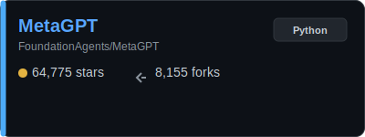
    </td>
  </tr>
</table>

<a href="#agents"><kbd>🛠️ Back to Section</kbd></a> · <a href="#contents"><kbd>📑 Contents</kbd></a>

<table width="100%" cellpadding="0" cellspacing="0">
  <tr>
    <td width="58%" valign="top">
      <h3><a href="https://github.com/cline/cline">cline</a> (Vault Mode)</h3>
      <table cellpadding="0" cellspacing="0"><tr><td>Autonomous coding agent right in your IDE, capable of</td></tr><tr><td>creating/editing files, executing commands, using the</td></tr><tr><td>browser, and more with your permission every step of the</td></tr></table>
    </td>
    <td width="42%" valign="top" align="center">
      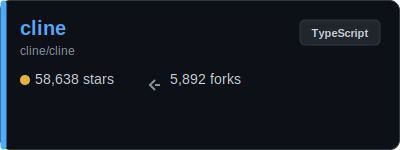
    </td>
  </tr>
</table>

<a href="#agents"><kbd>🛠️ Back to Section</kbd></a> · <a href="#contents"><kbd>📑 Contents</kbd></a>

<table width="100%" cellpadding="0" cellspacing="0">
  <tr>
    <td width="58%" valign="top">
      <h3><a href="https://github.com/microsoft/autogen">autogen</a> (Vault Mode)</h3>
      <table cellpadding="0" cellspacing="0"><tr><td>A programming framework for agentic AI</td></tr><tr><td>&nbsp;</td></tr><tr><td>&nbsp;</td></tr></table>
    </td>
    <td width="42%" valign="top" align="center">
      
    </td>
  </tr>
</table>

<a href="#agents"><kbd>🛠️ Back to Section</kbd></a> · <a href="#contents"><kbd>📑 Contents</kbd></a>

<table width="100%" cellpadding="0" cellspacing="0">
  <tr>
    <td width="58%" valign="top">
      <h3><a href="https://github.com/crewAIInc/crewAI">crewAI</a> (Vault Mode)</h3>
      <table cellpadding="0" cellspacing="0"><tr><td>Framework for orchestrating role-playing, autonomous AI</td></tr><tr><td>agents. By fostering collaborative intelligence, CrewAI</td></tr><tr><td>empowers agents to work together seamlessly, tackling</td></tr></table>
    </td>
    <td width="42%" valign="top" align="center">
      
    </td>
  </tr>
</table>

<a href="#agents"><kbd>🛠️ Back to Section</kbd></a> · <a href="#contents"><kbd>📑 Contents</kbd></a>

<table width="100%" cellpadding="0" cellspacing="0">
  <tr>
    <td width="58%" valign="top">
      <h3><a href="https://github.com/CherryHQ/cherry-studio">cherry-studio</a> (Vault Mode)</h3>
      <table cellpadding="0" cellspacing="0"><tr><td>AI productivity studio with smart chat, autonomous agents,</td></tr><tr><td>and 300+ assistants. Unified access to frontier LLMs</td></tr><tr><td>&nbsp;</td></tr></table>
    </td>
    <td width="42%" valign="top" align="center">
      
    </td>
  </tr>
</table>

<a href="#agents"><kbd>🛠️ Back to Section</kbd></a> · <a href="#contents"><kbd>📑 Contents</kbd></a>

<table width="100%" cellpadding="0" cellspacing="0">
  <tr>
    <td width="58%" valign="top">
      <h3><a href="https://github.com/khoj-ai/khoj">khoj</a> (Vault Mode)</h3>
      <table cellpadding="0" cellspacing="0"><tr><td>Your AI second brain. Self-hostable. Get answers from the</td></tr><tr><td>web or your docs. Build custom agents, schedule automations,</td></tr><tr><td>do deep research. Turn any online or local LLM into your</td></tr></table>
    </td>
    <td width="42%" valign="top" align="center">
      
    </td>
  </tr>
</table>

<a href="#agents"><kbd>🛠️ Back to Section</kbd></a> · <a href="#contents"><kbd>📑 Contents</kbd></a>

<table width="100%" cellpadding="0" cellspacing="0">
  <tr>
    <td width="58%" valign="top">
      <h3><a href="https://github.com/wshobson/agents">agents</a> (Vault Mode)</h3>
      <table cellpadding="0" cellspacing="0"><tr><td>Intelligent automation and multi-agent orchestration for</td></tr><tr><td>Claude Code</td></tr><tr><td>&nbsp;</td></tr></table>
    </td>
    <td width="42%" valign="top" align="center">
      
    </td>
  </tr>
</table>

<a href="#agents"><kbd>🛠️ Back to Section</kbd></a> · <a href="#contents"><kbd>📑 Contents</kbd></a>

<table width="100%" cellpadding="0" cellspacing="0">
  <tr>
    <td width="58%" valign="top">
      <h3><a href="https://github.com/langchain-ai/langgraph">langgraph</a> (Vault Mode)</h3>
      <table cellpadding="0" cellspacing="0"><tr><td>Build resilient language agents as graphs.</td></tr><tr><td>&nbsp;</td></tr><tr><td>&nbsp;</td></tr></table>
    </td>
    <td width="42%" valign="top" align="center">
      
    </td>
  </tr>
</table>

<a href="#agents"><kbd>🛠️ Back to Section</kbd></a> · <a href="#contents"><kbd>📑 Contents</kbd></a>

<table width="100%" cellpadding="0" cellspacing="0">
  <tr>
    <td width="58%" valign="top">
      <h3><a href="https://github.com/assafelovic/gpt-researcher">gpt-researcher</a> (Vault Mode)</h3>
      <table cellpadding="0" cellspacing="0"><tr><td>An autonomous agent that conducts deep research on any data</td></tr><tr><td>using any LLM providers</td></tr><tr><td>&nbsp;</td></tr></table>
    </td>
    <td width="42%" valign="top" align="center">
      
    </td>
  </tr>
</table>

<a href="#agents"><kbd>🛠️ Back to Section</kbd></a> · <a href="#contents"><kbd>📑 Contents</kbd></a>

<table width="100%" cellpadding="0" cellspacing="0">
  <tr>
    <td width="58%" valign="top">
      <h3><a href="https://github.com/Fosowl/agenticSeek">agenticSeek</a> (Vault Mode)</h3>
      <table cellpadding="0" cellspacing="0"><tr><td>Fully Local Manus AI. No APIs, No $200 monthly bills. Enjoy</td></tr><tr><td>an autonomous agent that thinks, browses the web, and code</td></tr><tr><td>for the sole cost of electricity. 🔔 Official updates only...</td></tr></table>
    </td>
    <td width="42%" valign="top" align="center">
      
    </td>
  </tr>
</table>

<a href="#agents"><kbd>🛠️ Back to Section</kbd></a> · <a href="#contents"><kbd>📑 Contents</kbd></a>

<table width="100%" cellpadding="0" cellspacing="0">
  <tr>
    <td width="58%" valign="top">
      <h3><a href="https://github.com/zai-org/Open-AutoGLM">Open-AutoGLM</a> (Vault Mode)</h3>
      <table cellpadding="0" cellspacing="0"><tr><td>An Open Phone Agent Model & Framework. Unlocking the AI</td></tr><tr><td>Phone for Everyone</td></tr><tr><td>&nbsp;</td></tr></table>
    </td>
    <td width="42%" valign="top" align="center">
      
    </td>
  </tr>
</table>

<a href="#agents"><kbd>🛠️ Back to Section</kbd></a> · <a href="#contents"><kbd>📑 Contents</kbd></a>

<table width="100%" cellpadding="0" cellspacing="0">
  <tr>
    <td width="58%" valign="top">
      <h3><a href="https://github.com/zeroclaw-labs/zeroclaw">zeroclaw</a> (Vault Mode)</h3>
      <table cellpadding="0" cellspacing="0"><tr><td>Fast, small, and fully autonomous AI assistant</td></tr><tr><td>infrastructure — deploy anywhere, swap anything 🦀</td></tr><tr><td>&nbsp;</td></tr></table>
    </td>
    <td width="42%" valign="top" align="center">
      
    </td>
  </tr>
</table>

<a href="#agents"><kbd>🛠️ Back to Section</kbd></a> · <a href="#contents"><kbd>📑 Contents</kbd></a>

<table width="100%" cellpadding="0" cellspacing="0">
  <tr>
    <td width="58%" valign="top">
      <h3><a href="https://github.com/mastra-ai/mastra">mastra</a> (Vault Mode)</h3>
      <table cellpadding="0" cellspacing="0"><tr><td>From the team behind Gatsby, Mastra is a framework for</td></tr><tr><td>building AI-powered applications and agents with a modern</td></tr><tr><td>TypeScript stack.</td></tr></table>
    </td>
    <td width="42%" valign="top" align="center">
      
    </td>
  </tr>
</table>

<a href="#agents"><kbd>🛠️ Back to Section</kbd></a> · <a href="#contents"><kbd>📑 Contents</kbd></a>

<table width="100%" cellpadding="0" cellspacing="0">
  <tr>
    <td width="58%" valign="top">
      <h3><a href="https://github.com/openai/openai-agents-python">openai-agents-python</a> (Vault Mode)</h3>
      <table cellpadding="0" cellspacing="0"><tr><td>A lightweight, powerful framework for multi-agent workflows</td></tr><tr><td>&nbsp;</td></tr><tr><td>&nbsp;</td></tr></table>
    </td>
    <td width="42%" valign="top" align="center">
      
    </td>
  </tr>
</table>

<a href="#agents"><kbd>🛠️ Back to Section</kbd></a> · <a href="#contents"><kbd>📑 Contents</kbd></a>

<table width="100%" cellpadding="0" cellspacing="0">
  <tr>
    <td width="58%" valign="top">
      <h3><a href="https://github.com/ruvnet/ruflo">ruflo</a> (Vault Mode)</h3>
      <table cellpadding="0" cellspacing="0"><tr><td>🌊 The leading agent orchestration platform for Claude.</td></tr><tr><td>Deploy intelligent multi-agent swarms, coordinate autonomous</td></tr><tr><td>workflows, and build conversational AI systems. Features</td></tr></table>
    </td>
    <td width="42%" valign="top" align="center">
      
    </td>
  </tr>
</table>

<a href="#agents"><kbd>🛠️ Back to Section</kbd></a> · <a href="#contents"><kbd>📑 Contents</kbd></a>

<table width="100%" cellpadding="0" cellspacing="0">
  <tr>
    <td width="58%" valign="top">
      <h3><a href="https://github.com/vercel-labs/agent-browser">agent-browser</a> (Vault Mode)</h3>
      <table cellpadding="0" cellspacing="0"><tr><td>Browser automation CLI for AI agents</td></tr><tr><td>&nbsp;</td></tr><tr><td>&nbsp;</td></tr></table>
    </td>
    <td width="42%" valign="top" align="center">
      
    </td>
  </tr>
</table>

<a href="#agents"><kbd>🛠️ Back to Section</kbd></a> · <a href="#contents"><kbd>📑 Contents</kbd></a>

<table width="100%" cellpadding="0" cellspacing="0">
  <tr>
    <td width="58%" valign="top">
      <h3><a href="https://github.com/humanlayer/12-factor-agents">12-factor-agents</a> (Vault Mode)</h3>
      <table cellpadding="0" cellspacing="0"><tr><td>What are the principles we can use to build LLM-powered</td></tr><tr><td>software that is actually good enough to put in the hands of</td></tr><tr><td>production customers?</td></tr></table>
    </td>
    <td width="42%" valign="top" align="center">
      
    </td>
  </tr>
</table>

<a href="#agents"><kbd>🛠️ Back to Section</kbd></a> · <a href="#contents"><kbd>📑 Contents</kbd></a>

<table width="100%" cellpadding="0" cellspacing="0">
  <tr>
    <td width="58%" valign="top">
      <h3><a href="https://github.com/emcie-co/parlant">parlant</a> (Vault Mode)</h3>
      <table cellpadding="0" cellspacing="0"><tr><td>The conversational control layer for customer-facing AI</td></tr><tr><td>agents - Parlant is a context-engineering framework</td></tr><tr><td>optimized for controlling customer interactions.</td></tr></table>
    </td>
    <td width="42%" valign="top" align="center">
      
    </td>
  </tr>
</table>

<a href="#agents"><kbd>🛠️ Back to Section</kbd></a> · <a href="#contents"><kbd>📑 Contents</kbd></a>

<table width="100%" cellpadding="0" cellspacing="0">
  <tr>
    <td width="58%" valign="top">
      <h3><a href="https://github.com/elizaOS/eliza">eliza</a> (Vault Mode)</h3>
      <table cellpadding="0" cellspacing="0"><tr><td>Autonomous agents for everyone</td></tr><tr><td>&nbsp;</td></tr><tr><td>&nbsp;</td></tr></table>
    </td>
    <td width="42%" valign="top" align="center">
      
    </td>
  </tr>
</table>

<a href="#agents"><kbd>🛠️ Back to Section</kbd></a> · <a href="#contents"><kbd>📑 Contents</kbd></a>

<table width="100%" cellpadding="0" cellspacing="0">
  <tr>
    <td width="58%" valign="top">
      <h3><a href="https://github.com/virattt/dexter">dexter</a> (Vault Mode)</h3>
      <table cellpadding="0" cellspacing="0"><tr><td>An autonomous agent for deep financial research</td></tr><tr><td>&nbsp;</td></tr><tr><td>&nbsp;</td></tr></table>
    </td>
    <td width="42%" valign="top" align="center">
      
    </td>
  </tr>
</table>

<a href="#agents"><kbd>🛠️ Back to Section</kbd></a> · <a href="#contents"><kbd>📑 Contents</kbd></a>

<table width="100%" cellpadding="0" cellspacing="0">
  <tr>
    <td width="58%" valign="top">
      <h3><a href="https://github.com/raga-ai-hub/RagaAI-Catalyst">RagaAI-Catalyst</a> (Vault Mode)</h3>
      <table cellpadding="0" cellspacing="0"><tr><td>Python SDK for Agent AI Observability, Monitoring and</td></tr><tr><td>Evaluation Framework. Includes features like agent, llm and</td></tr><tr><td>tools tracing, debugging multi-agentic system, self-hosted</td></tr></table>
    </td>
    <td width="42%" valign="top" align="center">
      
    </td>
  </tr>
</table>

<a href="#agents"><kbd>🛠️ Back to Section</kbd></a> · <a href="#contents"><kbd>📑 Contents</kbd></a>

<table width="100%" cellpadding="0" cellspacing="0">
  <tr>
    <td width="58%" valign="top">
      <h3><a href="https://github.com/agent0ai/agent-zero">agent-zero</a> (Vault Mode)</h3>
      <table cellpadding="0" cellspacing="0"><tr><td>Agent Zero AI framework</td></tr><tr><td>&nbsp;</td></tr><tr><td>&nbsp;</td></tr></table>
    </td>
    <td width="42%" valign="top" align="center">
      
    </td>
  </tr>
</table>

<a href="#agents"><kbd>🛠️ Back to Section</kbd></a> · <a href="#contents"><kbd>📑 Contents</kbd></a>

<table width="100%" cellpadding="0" cellspacing="0">
  <tr>
    <td width="58%" valign="top">
      <h3><a href="https://github.com/pydantic/pydantic-ai">pydantic-ai</a> (Vault Mode)</h3>
      <table cellpadding="0" cellspacing="0"><tr><td>GenAI Agent Framework, the Pydantic way</td></tr><tr><td>&nbsp;</td></tr><tr><td>&nbsp;</td></tr></table>
    </td>
    <td width="42%" valign="top" align="center">
      
    </td>
  </tr>
</table>

<a href="#agents"><kbd>🛠️ Back to Section</kbd></a> · <a href="#contents"><kbd>📑 Contents</kbd></a>

<table width="100%" cellpadding="0" cellspacing="0">
  <tr>
    <td width="58%" valign="top">
      <h3><a href="https://github.com/Tencent/WeKnora">WeKnora</a> (Vault Mode)</h3>
      <table cellpadding="0" cellspacing="0"><tr><td>LLM-powered framework for deep document understanding,</td></tr><tr><td>semantic retrieval, and context-aware answers using RAG</td></tr><tr><td>paradigm.</td></tr></table>
    </td>
    <td width="42%" valign="top" align="center">
      
    </td>
  </tr>
</table>

<a href="#agents"><kbd>🛠️ Back to Section</kbd></a> · <a href="#contents"><kbd>📑 Contents</kbd></a>

<table width="100%" cellpadding="0" cellspacing="0">
  <tr>
    <td width="58%" valign="top">
      <h3><a href="https://github.com/nanobrowser/nanobrowser">nanobrowser</a> (Vault Mode)</h3>
      <table cellpadding="0" cellspacing="0"><tr><td>Open-Source Chrome extension for AI-powered web automation.</td></tr><tr><td>Run multi-agent workflows using your own LLM API key.</td></tr><tr><td>Alternative to OpenAI Operator.</td></tr></table>
    </td>
    <td width="42%" valign="top" align="center">
      
    </td>
  </tr>
</table>

<a href="#agents"><kbd>🛠️ Back to Section</kbd></a> · <a href="#contents"><kbd>📑 Contents</kbd></a>

<table width="100%" cellpadding="0" cellspacing="0">
  <tr>
    <td width="58%" valign="top">
      <h3><a href="https://github.com/snarktank/ralph">ralph</a> (Vault Mode)</h3>
      <table cellpadding="0" cellspacing="0"><tr><td>Ralph is an autonomous AI agent loop that runs repeatedly</td></tr><tr><td>until all PRD items are complete.</td></tr><tr><td>&nbsp;</td></tr></table>
    </td>
    <td width="42%" valign="top" align="center">
      
    </td>
  </tr>
</table>

<a href="#agents"><kbd>🛠️ Back to Section</kbd></a> · <a href="#contents"><kbd>📑 Contents</kbd></a>

<table width="100%" cellpadding="0" cellspacing="0">
  <tr>
    <td width="58%" valign="top">
      <h3><a href="https://github.com/iflytek/astron-agent">astron-agent</a> (Vault Mode)</h3>
      <table cellpadding="0" cellspacing="0"><tr><td>Enterprise-grade, commercial-friendly agentic workflow</td></tr><tr><td>platform for building next-generation SuperAgents.</td></tr><tr><td>&nbsp;</td></tr></table>
    </td>
    <td width="42%" valign="top" align="center">
      
    </td>
  </tr>
</table>

<a href="#agents"><kbd>🛠️ Back to Section</kbd></a> · <a href="#contents"><kbd>📑 Contents</kbd></a>

<table width="100%" cellpadding="0" cellspacing="0">
  <tr>
    <td width="58%" valign="top">
      <h3><a href="https://github.com/mcp-use/mcp-use">mcp-use</a> (Vault Mode)</h3>
      <table cellpadding="0" cellspacing="0"><tr><td>The fullstack MCP framework to develop MCP Apps for ChatGPT</td></tr><tr><td>/ Claude & MCP Servers for AI Agents.</td></tr><tr><td>&nbsp;</td></tr></table>
    </td>
    <td width="42%" valign="top" align="center">
      
    </td>
  </tr>
</table>

<a href="#agents"><kbd>🛠️ Back to Section</kbd></a> · <a href="#contents"><kbd>📑 Contents</kbd></a>

<table width="100%" cellpadding="0" cellspacing="0">
  <tr>
    <td width="58%" valign="top">
      <h3><a href="https://github.com/vxcontrol/pentagi">pentagi</a> (Vault Mode)</h3>
      <table cellpadding="0" cellspacing="0"><tr><td>✨ Fully autonomous AI Agents system capable of performing</td></tr><tr><td>complex penetration testing tasks</td></tr><tr><td>&nbsp;</td></tr></table>
    </td>
    <td width="42%" valign="top" align="center">
      
    </td>
  </tr>
</table>

<a href="#agents"><kbd>🛠️ Back to Section</kbd></a> · <a href="#contents"><kbd>📑 Contents</kbd></a>

<table width="100%" cellpadding="0" cellspacing="0">
  <tr>
    <td width="58%" valign="top">
      <h3><a href="https://github.com/Yeachan-Heo/oh-my-claudecode">oh-my-claudecode</a> (Vault Mode)</h3>
      <table cellpadding="0" cellspacing="0"><tr><td>Teams-first Multi-agent orchestration for Claude Code</td></tr><tr><td>&nbsp;</td></tr><tr><td>&nbsp;</td></tr></table>
    </td>
    <td width="42%" valign="top" align="center">
      
    </td>
  </tr>
</table>

<a href="#agents"><kbd>🛠️ Back to Section</kbd></a> · <a href="#contents"><kbd>📑 Contents</kbd></a>

<table width="100%" cellpadding="0" cellspacing="0">
  <tr>
    <td width="58%" valign="top">
      <h3><a href="https://github.com/microsoft/agent-framework">agent-framework</a> (Vault Mode)</h3>
      <table cellpadding="0" cellspacing="0"><tr><td>A framework for building, orchestrating and deploying AI</td></tr><tr><td>agents and multi-agent workflows with support for Python and</td></tr><tr><td>.NET.</td></tr></table>
    </td>
    <td width="42%" valign="top" align="center">
      
    </td>
  </tr>
</table>

<a href="#agents"><kbd>🛠️ Back to Section</kbd></a> · <a href="#contents"><kbd>📑 Contents</kbd></a>

<table width="100%" cellpadding="0" cellspacing="0">
  <tr>
    <td width="58%" valign="top">
      <h3><a href="https://github.com/0x4m4/hexstrike-ai">hexstrike-ai</a> (Vault Mode)</h3>
      <table cellpadding="0" cellspacing="0"><tr><td>HexStrike AI MCP Agents is an advanced MCP server that lets</td></tr><tr><td>AI agents (Claude, GPT, Copilot, etc.) autonomously run 150+</td></tr><tr><td>cybersecurity tools for automated pentesting, vulnerabil...</td></tr></table>
    </td>
    <td width="42%" valign="top" align="center">
      
    </td>
  </tr>
</table>

<a href="#agents"><kbd>🛠️ Back to Section</kbd></a> · <a href="#contents"><kbd>📑 Contents</kbd></a>

<table width="100%" cellpadding="0" cellspacing="0">
  <tr>
    <td width="58%" valign="top">
      <h3><a href="https://github.com/VoltAgent/voltagent">voltagent</a> (Vault Mode)</h3>
      <table cellpadding="0" cellspacing="0"><tr><td>AI Agent Engineering Platform built on an Open Source</td></tr><tr><td>TypeScript AI Agent Framework</td></tr><tr><td>&nbsp;</td></tr></table>
    </td>
    <td width="42%" valign="top" align="center">
      
    </td>
  </tr>
</table>

<a href="#agents"><kbd>🛠️ Back to Section</kbd></a> · <a href="#contents"><kbd>📑 Contents</kbd></a>

<table width="100%" cellpadding="0" cellspacing="0">
  <tr>
    <td width="58%" valign="top">
      <h3><a href="https://github.com/MemMachine/MemMachine">MemMachine</a> (Vault Mode)</h3>
      <table cellpadding="0" cellspacing="0"><tr><td>Universal memory layer for AI Agents. It provides scalable,</td></tr><tr><td>extensible, and interoperable memory storage and retrieval</td></tr><tr><td>to streamline AI agent state management for</td></tr></table>
    </td>
    <td width="42%" valign="top" align="center">
      
    </td>
  </tr>
</table>

<a href="#agents"><kbd>🛠️ Back to Section</kbd></a> · <a href="#contents"><kbd>📑 Contents</kbd></a>

<table width="100%" cellpadding="0" cellspacing="0">
  <tr>
    <td width="58%" valign="top">
      <h3><a href="https://github.com/ruc-datalab/DeepAnalyze">DeepAnalyze</a> (Vault Mode)</h3>
      <table cellpadding="0" cellspacing="0"><tr><td>DeepAnalyze is the first agentic LLM for autonomous data</td></tr><tr><td>science. 🎈你的AI数据分析师，自动分析大量数据，一键生成专业分析报告！</td></tr><tr><td>&nbsp;</td></tr></table>
    </td>
    <td width="42%" valign="top" align="center">
      
    </td>
  </tr>
</table>

<a href="#agents"><kbd>🛠️ Back to Section</kbd></a> · <a href="#contents"><kbd>📑 Contents</kbd></a>

<table width="100%" cellpadding="0" cellspacing="0">
  <tr>
    <td width="58%" valign="top">
      <h3><a href="https://github.com/ComposioHQ/agent-orchestrator">agent-orchestrator</a> (Vault Mode)</h3>
      <table cellpadding="0" cellspacing="0"><tr><td>Agentic orchestrator for parallel coding agents — plans</td></tr><tr><td>tasks, spawns agents, and autonomously handles CI fixes,</td></tr><tr><td>merge conflicts, and code reviews.</td></tr></table>
    </td>
    <td width="42%" valign="top" align="center">
      
    </td>
  </tr>
</table>

<a href="#agents"><kbd>🛠️ Back to Section</kbd></a> · <a href="#contents"><kbd>📑 Contents</kbd></a>

<table width="100%" cellpadding="0" cellspacing="0">
  <tr>
    <td width="58%" valign="top">
      <h3><a href="https://github.com/VibiumDev/vibium">vibium</a> (Vault Mode)</h3>
      <table cellpadding="0" cellspacing="0"><tr><td>Browser automation for AI agents and humans</td></tr><tr><td>&nbsp;</td></tr><tr><td>&nbsp;</td></tr></table>
    </td>
    <td width="42%" valign="top" align="center">
      
    </td>
  </tr>
</table>

<a href="#agents"><kbd>🛠️ Back to Section</kbd></a> · <a href="#contents"><kbd>📑 Contents</kbd></a>

<table width="100%" cellpadding="0" cellspacing="0">
  <tr>
    <td width="58%" valign="top">
      <h3><a href="https://github.com/michaelshimeles/ralphy">ralphy</a> (Vault Mode)</h3>
      <table cellpadding="0" cellspacing="0"><tr><td>My Ralph Wiggum setup, an autonomous bash script that runs</td></tr><tr><td>Claude Code, Codex, OpenCode, Cursor agent, Qwen & Droid in</td></tr><tr><td>a loop until your PRD is complete.</td></tr></table>
    </td>
    <td width="42%" valign="top" align="center">
      
    </td>
  </tr>
</table>

<a href="#agents"><kbd>🛠️ Back to Section</kbd></a> · <a href="#contents"><kbd>📑 Contents</kbd></a>

<table width="100%" cellpadding="0" cellspacing="0">
  <tr>
    <td width="58%" valign="top">
      <h3><a href="https://github.com/openai/symphony">symphony</a> (Vault Mode)</h3>
      <table cellpadding="0" cellspacing="0"><tr><td>Symphony turns project work into isolated, autonomous</td></tr><tr><td>implementation runs, allowing teams to manage work instead</td></tr><tr><td>of supervising coding agents.</td></tr></table>
    </td>
    <td width="42%" valign="top" align="center">
      
    </td>
  </tr>
</table>

<a href="#agents"><kbd>🛠️ Back to Section</kbd></a> · <a href="#contents"><kbd>📑 Contents</kbd></a>

<table width="100%" cellpadding="0" cellspacing="0">
  <tr>
    <td width="58%" valign="top">
      <h3><a href="https://github.com/abhi1693/openclaw-mission-control">openclaw-mission-control</a> (Vault Mode)</h3>
      <table cellpadding="0" cellspacing="0"><tr><td>AI Agent Orchestration Dashboard - Manage AI agents, assign</td></tr><tr><td>tasks, and coordinate multi-agent collaboration via OpenClaw</td></tr><tr><td>Gateway.</td></tr></table>
    </td>
    <td width="42%" valign="top" align="center">
      
    </td>
  </tr>
</table>

<a href="#agents"><kbd>🛠️ Back to Section</kbd></a> · <a href="#contents"><kbd>📑 Contents</kbd></a>

<table width="100%" cellpadding="0" cellspacing="0">
  <tr>
    <td width="58%" valign="top">
      <h3><a href="https://github.com/samugit83/redamon">redamon</a> (Vault Mode)</h3>
      <table cellpadding="0" cellspacing="0"><tr><td>An AI-powered agentic red team framework that automates</td></tr><tr><td>offensive security operations, from reconnaissance to</td></tr><tr><td>exploitation to post-exploitation, with zero human</td></tr></table>
    </td>
    <td width="42%" valign="top" align="center">
      
    </td>
  </tr>
</table>

<a href="#agents"><kbd>🛠️ Back to Section</kbd></a> · <a href="#contents"><kbd>📑 Contents</kbd></a>

<table width="100%" cellpadding="0" cellspacing="0">
  <tr>
    <td width="58%" valign="top">
      <h3><a href="https://github.com/cft0808/edict">edict</a> (Vault Mode)</h3>
      <table cellpadding="0" cellspacing="0"><tr><td>🏛️ 三省六部制 · OpenClaw Multi-Agent Orchestration System — 9</td></tr><tr><td>specialized AI agents with real-time dashboard, model</td></tr><tr><td>config, and full audit trails</td></tr></table>
    </td>
    <td width="42%" valign="top" align="center">
      
    </td>
  </tr>
</table>

<a href="#agents"><kbd>🛠️ Back to Section</kbd></a> · <a href="#contents"><kbd>📑 Contents</kbd></a>

<table width="100%" cellpadding="0" cellspacing="0">
  <tr>
    <td width="58%" valign="top">
      <h3><a href="https://github.com/crshdn/mission-control">mission-control</a> (Vault Mode)</h3>
      <table cellpadding="0" cellspacing="0"><tr><td>AI Agent Orchestration Dashboard - Manage AI agents, assign</td></tr><tr><td>tasks, and coordinate multi-agent collaboration via OpenClaw</td></tr><tr><td>Gateway.</td></tr></table>
    </td>
    <td width="42%" valign="top" align="center">
      
    </td>
  </tr>
</table>

<a href="#agents"><kbd>🛠️ Back to Section</kbd></a> · <a href="#contents"><kbd>📑 Contents</kbd></a>

<table width="100%" cellpadding="0" cellspacing="0">
  <tr>
    <td width="58%" valign="top">
      <h3><a href="https://github.com/yohey-w/multi-agent-shogun">multi-agent-shogun</a> (Vault Mode)</h3>
      <table cellpadding="0" cellspacing="0"><tr><td>Samurai-inspired multi-agent system for Claude Code.</td></tr><tr><td>Orchestrate parallel AI tasks via tmux with shogun → karo →</td></tr><tr><td>ashigaru hierarchy.</td></tr></table>
    </td>
    <td width="42%" valign="top" align="center">
      
    </td>
  </tr>
</table>

<a href="#agents"><kbd>🛠️ Back to Section</kbd></a> · <a href="#contents"><kbd>📑 Contents</kbd></a>

<table width="100%" cellpadding="0" cellspacing="0">
  <tr>
    <td width="58%" valign="top">
      <h3><a href="https://github.com/deanpeters/Product-Manager-Skills">Product-Manager-Skills</a> (Vault Mode)</h3>
      <table cellpadding="0" cellspacing="0"><tr><td>Product Management skills framework built on battle-tested</td></tr><tr><td>methods for Claude Code, Cowork, Codex, and AI agents.</td></tr><tr><td>&nbsp;</td></tr></table>
    </td>
    <td width="42%" valign="top" align="center">
      
    </td>
  </tr>
</table>

<a href="#agents"><kbd>🛠️ Back to Section</kbd></a> · <a href="#contents"><kbd>📑 Contents</kbd></a>

<table width="100%" cellpadding="0" cellspacing="0">
  <tr>
    <td width="58%" valign="top">
      <h3><a href="https://github.com/stephengpope/thepopebot">thepopebot</a> (Vault Mode)</h3>
      <table cellpadding="0" cellspacing="0"><tr><td>The Pope Bot is an autonomous AI agent that you can</td></tr><tr><td>configure and build to do just about anything you want, all</td></tr><tr><td>day, everyday, 24/7.</td></tr></table>
    </td>
    <td width="42%" valign="top" align="center">
      
    </td>
  </tr>
</table>

<a href="#agents"><kbd>🛠️ Back to Section</kbd></a> · <a href="#contents"><kbd>📑 Contents</kbd></a>

<table width="100%" cellpadding="0" cellspacing="0">
  <tr>
    <td width="58%" valign="top">
      <h3><a href="https://github.com/openakita/openakita">openakita</a> (Vault Mode)</h3>
      <table cellpadding="0" cellspacing="0"><tr><td>An open-source AI assistant framework with skills and agent</td></tr><tr><td>architecture</td></tr><tr><td>&nbsp;</td></tr></table>
    </td>
    <td width="42%" valign="top" align="center">
      
    </td>
  </tr>
</table>

<a href="#agents"><kbd>🛠️ Back to Section</kbd></a> · <a href="#contents"><kbd>📑 Contents</kbd></a>

<table width="100%" cellpadding="0" cellspacing="0">
  <tr>
    <td width="58%" valign="top">
      <h3><a href="https://github.com/ygwyg/MAHORAGA">MAHORAGA</a> (Vault Mode)</h3>
      <table cellpadding="0" cellspacing="0"><tr><td>autonomous trading agent powered by social sentiment</td></tr><tr><td>analysis and ai that learns, grows, and adapts</td></tr><tr><td>&nbsp;</td></tr></table>
    </td>
    <td width="42%" valign="top" align="center">
      
    </td>
  </tr>
</table>

<a href="#agents"><kbd>🛠️ Back to Section</kbd></a> · <a href="#contents"><kbd>📑 Contents</kbd></a>

<table width="100%" cellpadding="0" cellspacing="0">
  <tr>
    <td width="58%" valign="top">
      <h3><a href="https://github.com/jayminwest/overstory">overstory</a> (Vault Mode)</h3>
      <table cellpadding="0" cellspacing="0"><tr><td>Multi-agent orchestration for AI coding agents — pluggable</td></tr><tr><td>runtime adapters for Claude Code, Pi, and more</td></tr><tr><td>&nbsp;</td></tr></table>
    </td>
    <td width="42%" valign="top" align="center">
      
    </td>
  </tr>
</table>

<a href="#agents"><kbd>🛠️ Back to Section</kbd></a> · <a href="#contents"><kbd>📑 Contents</kbd></a>

---

<h2 id='cli_tools'>💻 AI-Powered CLI & DevTools</h2>

 Section color

<table width="100%" cellpadding="0" cellspacing="0">
  <tr>
    <td width="58%" valign="top">
      <h3><a href="https://github.com/warpdotdev/Warp">Warp</a> (Vault Mode)</h3>
      <table cellpadding="0" cellspacing="0"><tr><td>Warp is the agentic development environment, built for</td></tr><tr><td>coding with multiple AI agents.</td></tr><tr><td>&nbsp;</td></tr></table>
    </td>
    <td width="42%" valign="top" align="center">
      
    </td>
  </tr>
</table>

<a href="#cli_tools"><kbd>💻 Back to Section</kbd></a> · <a href="#contents"><kbd>📑 Contents</kbd></a>

<table width="100%" cellpadding="0" cellspacing="0">
  <tr>
    <td width="58%" valign="top">
      <h3><a href="https://github.com/farion1231/cc-switch">cc-switch</a> (Vault Mode)</h3>
      <table cellpadding="0" cellspacing="0"><tr><td>A cross-platform desktop All-in-One assistant tool for</td></tr><tr><td>Claude Code, Codex, OpenCode, openclaw & Gemini CLI.</td></tr><tr><td>&nbsp;</td></tr></table>
    </td>
    <td width="42%" valign="top" align="center">
      
    </td>
  </tr>
</table>

<a href="#cli_tools"><kbd>💻 Back to Section</kbd></a> · <a href="#contents"><kbd>📑 Contents</kbd></a>

<table width="100%" cellpadding="0" cellspacing="0">
  <tr>
    <td width="58%" valign="top">
      <h3><a href="https://github.com/plandex-ai/plandex">plandex</a> (Vault Mode)</h3>
      <table cellpadding="0" cellspacing="0"><tr><td>Open source AI coding agent. Designed for large projects and</td></tr><tr><td>real world tasks.</td></tr><tr><td>&nbsp;</td></tr></table>
    </td>
    <td width="42%" valign="top" align="center">
      
    </td>
  </tr>
</table>

<a href="#cli_tools"><kbd>💻 Back to Section</kbd></a> · <a href="#contents"><kbd>📑 Contents</kbd></a>

<table width="100%" cellpadding="0" cellspacing="0">
  <tr>
    <td width="58%" valign="top">
      <h3><a href="https://github.com/sigoden/aichat">aichat</a> (Vault Mode)</h3>
      <table cellpadding="0" cellspacing="0"><tr><td>All-in-one LLM CLI tool featuring Shell Assistant,</td></tr><tr><td>Chat-REPL, RAG, AI Tools & Agents, with access to OpenAI,</td></tr><tr><td>Claude, Gemini, Ollama, Groq, and more.</td></tr></table>
    </td>
    <td width="42%" valign="top" align="center">
      
    </td>
  </tr>
</table>

<a href="#cli_tools"><kbd>💻 Back to Section</kbd></a> · <a href="#contents"><kbd>📑 Contents</kbd></a>

<table width="100%" cellpadding="0" cellspacing="0">
  <tr>
    <td width="58%" valign="top">
      <h3><a href="https://github.com/GoogleCloudPlatform/kubectl-ai">kubectl-ai</a> (Vault Mode)</h3>
      <table cellpadding="0" cellspacing="0"><tr><td>AI powered Kubernetes Assistant</td></tr><tr><td>&nbsp;</td></tr><tr><td>&nbsp;</td></tr></table>
    </td>
    <td width="42%" valign="top" align="center">
      
    </td>
  </tr>
</table>

<a href="#cli_tools"><kbd>💻 Back to Section</kbd></a> · <a href="#contents"><kbd>📑 Contents</kbd></a>

<table width="100%" cellpadding="0" cellspacing="0">
  <tr>
    <td width="58%" valign="top">
      <h3><a href="https://github.com/Maciek-roboblog/Claude-Code-Usage-Monitor">Claude-Code-Usage-Monitor</a> (Vault Mode)</h3>
      <table cellpadding="0" cellspacing="0"><tr><td>Real-time Claude Code usage monitor with predictions and</td></tr><tr><td>warnings</td></tr><tr><td>&nbsp;</td></tr></table>
    </td>
    <td width="42%" valign="top" align="center">
      
    </td>
  </tr>
</table>

<a href="#cli_tools"><kbd>💻 Back to Section</kbd></a> · <a href="#contents"><kbd>📑 Contents</kbd></a>

<table width="100%" cellpadding="0" cellspacing="0">
  <tr>
    <td width="58%" valign="top">
      <h3><a href="https://github.com/purocean/yn">yn</a> (Vault Mode)</h3>
      <table cellpadding="0" cellspacing="0"><tr><td>A highly extensible Markdown editor. Version control, AI</td></tr><tr><td>Copilot, mind map, documents encryption, code snippet</td></tr><tr><td>running, integrated terminal, chart embedding, HTML applets,</td></tr></table>
    </td>
    <td width="42%" valign="top" align="center">
      
    </td>
  </tr>
</table>

<a href="#cli_tools"><kbd>💻 Back to Section</kbd></a> · <a href="#contents"><kbd>📑 Contents</kbd></a>

<table width="100%" cellpadding="0" cellspacing="0">
  <tr>
    <td width="58%" valign="top">
      <h3><a href="https://github.com/smtg-ai/claude-squad">claude-squad</a> (Vault Mode)</h3>
      <table cellpadding="0" cellspacing="0"><tr><td>Manage multiple AI terminal agents like Claude Code, Aider,</td></tr><tr><td>Codex, OpenCode, and Amp.</td></tr><tr><td>&nbsp;</td></tr></table>
    </td>
    <td width="42%" valign="top" align="center">
      
    </td>
  </tr>
</table>

<a href="#cli_tools"><kbd>💻 Back to Section</kbd></a> · <a href="#contents"><kbd>📑 Contents</kbd></a>

<table width="100%" cellpadding="0" cellspacing="0">
  <tr>
    <td width="58%" valign="top">
      <h3><a href="https://github.com/superset-sh/superset">superset</a> (Vault Mode)</h3>
      <table cellpadding="0" cellspacing="0"><tr><td>IDE for the AI Agents Era - Run an army of Claude Code,</td></tr><tr><td>Codex, etc. on your machine</td></tr><tr><td>&nbsp;</td></tr></table>
    </td>
    <td width="42%" valign="top" align="center">
      
    </td>
  </tr>
</table>

<a href="#cli_tools"><kbd>💻 Back to Section</kbd></a> · <a href="#contents"><kbd>📑 Contents</kbd></a>

<table width="100%" cellpadding="0" cellspacing="0">
  <tr>
    <td width="58%" valign="top">
      <h3><a href="https://github.com/manaflow-ai/cmux">cmux</a> (Vault Mode)</h3>
      <table cellpadding="0" cellspacing="0"><tr><td>Ghostty-based macOS terminal with vertical tabs and</td></tr><tr><td>notifications for AI coding agents</td></tr><tr><td>&nbsp;</td></tr></table>
    </td>
    <td width="42%" valign="top" align="center">
      
    </td>
  </tr>
</table>

<a href="#cli_tools"><kbd>💻 Back to Section</kbd></a> · <a href="#contents"><kbd>📑 Contents</kbd></a>

<table width="100%" cellpadding="0" cellspacing="0">
  <tr>
    <td width="58%" valign="top">
      <h3><a href="https://github.com/jamesmurdza/awesome-ai-devtools">awesome-ai-devtools</a> (Vault Mode)</h3>
      <table cellpadding="0" cellspacing="0"><tr><td>Curated list of AI-powered developer tools.</td></tr><tr><td>&nbsp;</td></tr><tr><td>&nbsp;</td></tr></table>
    </td>
    <td width="42%" valign="top" align="center">
      
    </td>
  </tr>
</table>

<a href="#cli_tools"><kbd>💻 Back to Section</kbd></a> · <a href="#contents"><kbd>📑 Contents</kbd></a>

<table width="100%" cellpadding="0" cellspacing="0">
  <tr>
    <td width="58%" valign="top">
      <h3><a href="https://github.com/smallcloudai/refact">refact</a> (Vault Mode)</h3>
      <table cellpadding="0" cellspacing="0"><tr><td>AI Agent that handles engineering tasks end-to-end:</td></tr><tr><td>integrates with developers’ tools, plans, executes, and</td></tr><tr><td>iterates until it achieves a successful result.</td></tr></table>
    </td>
    <td width="42%" valign="top" align="center">
      
    </td>
  </tr>
</table>

<a href="#cli_tools"><kbd>💻 Back to Section</kbd></a> · <a href="#contents"><kbd>📑 Contents</kbd></a>

<table width="100%" cellpadding="0" cellspacing="0">
  <tr>
    <td width="58%" valign="top">
      <h3><a href="https://github.com/PeonPing/peon-ping">peon-ping</a> (Vault Mode)</h3>
      <table cellpadding="0" cellspacing="0"><tr><td>Warcraft III Peon voice notifications (+ more!) for Claude</td></tr><tr><td>Code, Codex, IDEs, and any AI agent. Stop babysitting your</td></tr><tr><td>terminal. Employ a Peon today.</td></tr></table>
    </td>
    <td width="42%" valign="top" align="center">
      
    </td>
  </tr>
</table>

<a href="#cli_tools"><kbd>💻 Back to Section</kbd></a> · <a href="#contents"><kbd>📑 Contents</kbd></a>

<table width="100%" cellpadding="0" cellspacing="0">
  <tr>
    <td width="58%" valign="top">
      <h3><a href="https://github.com/cirosantilli/china-dictatorship">china-dictatorship</a> (Vault Mode)</h3>
      <table cellpadding="0" cellspacing="0"><tr><td>反中共政治宣传库。Anti Chinese government propaganda.</td></tr><tr><td>住在中国真名用户的网友请别给星星，不然你要被警察请喝茶。常见问答集，新闻集和饭店和音乐建议。卐习万岁卐。冠状病毒审查郝海东新疆改造中心六四事件法轮功</td></tr><tr><td>996.ICU709大抓捕巴拿马文件邓家贵低端人口西藏骚乱。Friends who live in China a...</td></tr></table>
    </td>
    <td width="42%" valign="top" align="center">
      
    </td>
  </tr>
</table>

<a href="#cli_tools"><kbd>💻 Back to Section</kbd></a> · <a href="#contents"><kbd>📑 Contents</kbd></a>

<table width="100%" cellpadding="0" cellspacing="0">
  <tr>
    <td width="58%" valign="top">
      <h3><a href="https://github.com/tw93/Kaku">Kaku</a> (Vault Mode)</h3>
      <table cellpadding="0" cellspacing="0"><tr><td>🎃 A fast, out-of-the-box terminal built for AI coding.</td></tr><tr><td>&nbsp;</td></tr><tr><td>&nbsp;</td></tr></table>
    </td>
    <td width="42%" valign="top" align="center">
      
    </td>
  </tr>
</table>

<a href="#cli_tools"><kbd>💻 Back to Section</kbd></a> · <a href="#contents"><kbd>📑 Contents</kbd></a>

<table width="100%" cellpadding="0" cellspacing="0">
  <tr>
    <td width="58%" valign="top">
      <h3><a href="https://github.com/generalaction/emdash">emdash</a> (Vault Mode)</h3>
      <table cellpadding="0" cellspacing="0"><tr><td>Emdash is the Open-Source Agentic Development Environment (🧡</td></tr><tr><td>YC W26). Run multiple coding agents in parallel. Use any</td></tr><tr><td>provider.</td></tr></table>
    </td>
    <td width="42%" valign="top" align="center">
      
    </td>
  </tr>
</table>

<a href="#cli_tools"><kbd>💻 Back to Section</kbd></a> · <a href="#contents"><kbd>📑 Contents</kbd></a>

<table width="100%" cellpadding="0" cellspacing="0">
  <tr>
    <td width="58%" valign="top">
      <h3><a href="https://github.com/yaolifeng0629/Awesome-independent-tools">Awesome-independent-tools</a> (Vault Mode)</h3>
      <table cellpadding="0" cellspacing="0"><tr><td>收录独立开发、AI出海领域最新、最实用的工具与资源（Build Faster with Better Tools）</td></tr><tr><td>&nbsp;</td></tr><tr><td>&nbsp;</td></tr></table>
    </td>
    <td width="42%" valign="top" align="center">
      
    </td>
  </tr>
</table>

<a href="#cli_tools"><kbd>💻 Back to Section</kbd></a> · <a href="#contents"><kbd>📑 Contents</kbd></a>

<table width="100%" cellpadding="0" cellspacing="0">
  <tr>
    <td width="58%" valign="top">
      <h3><a href="https://github.com/jamubc/gemini-mcp-tool">gemini-mcp-tool</a> (Vault Mode)</h3>
      <table cellpadding="0" cellspacing="0"><tr><td>MCP server that enables AI assistants to interact with</td></tr><tr><td>Google Gemini CLI, leveraging Gemini's massive token window</td></tr><tr><td>for large file analysis and codebase understanding</td></tr></table>
    </td>
    <td width="42%" valign="top" align="center">
      
    </td>
  </tr>
</table>

<a href="#cli_tools"><kbd>💻 Back to Section</kbd></a> · <a href="#contents"><kbd>📑 Contents</kbd></a>

<table width="100%" cellpadding="0" cellspacing="0">
  <tr>
    <td width="58%" valign="top">
      <h3><a href="https://github.com/greggh/claude-code.nvim">claude-code.nvim</a> (Vault Mode)</h3>
      <table cellpadding="0" cellspacing="0"><tr><td>Seamless integration between Claude Code AI assistant and</td></tr><tr><td>Neovim</td></tr><tr><td>&nbsp;</td></tr></table>
    </td>
    <td width="42%" valign="top" align="center">
      
    </td>
  </tr>
</table>

<a href="#cli_tools"><kbd>💻 Back to Section</kbd></a> · <a href="#contents"><kbd>📑 Contents</kbd></a>

<table width="100%" cellpadding="0" cellspacing="0">
  <tr>
    <td width="58%" valign="top">
      <h3><a href="https://github.com/microsoft/responsible-ai-toolbox">responsible-ai-toolbox</a> (Vault Mode)</h3>
      <table cellpadding="0" cellspacing="0"><tr><td>Responsible AI Toolbox is a suite of tools providing model</td></tr><tr><td>and data exploration and assessment user interfaces and</td></tr><tr><td>libraries that enable a better understanding of AI systems.</td></tr></table>
    </td>
    <td width="42%" valign="top" align="center">
      
    </td>
  </tr>
</table>

<a href="#cli_tools"><kbd>💻 Back to Section</kbd></a> · <a href="#contents"><kbd>📑 Contents</kbd></a>

<table width="100%" cellpadding="0" cellspacing="0">
  <tr>
    <td width="58%" valign="top">
      <h3><a href="https://github.com/can1357/oh-my-pi">oh-my-pi</a> (Vault Mode)</h3>
      <table cellpadding="0" cellspacing="0"><tr><td>⌥ AI Coding agent for the terminal — hash-anchored edits,</td></tr><tr><td>optimized tool harness, LSP, Python, browser, subagents, and</td></tr><tr><td>more</td></tr></table>
    </td>
    <td width="42%" valign="top" align="center">
      
    </td>
  </tr>
</table>

<a href="#cli_tools"><kbd>💻 Back to Section</kbd></a> · <a href="#contents"><kbd>📑 Contents</kbd></a>

<table width="100%" cellpadding="0" cellspacing="0">
  <tr>
    <td width="58%" valign="top">
      <h3><a href="https://github.com/XiaomingX/indie-hacker-tools-plus">indie-hacker-tools-plus</a> (Vault Mode)</h3>
      <table cellpadding="0" cellspacing="0"><tr><td>为独立开发者准备的精选技术栈和工具仓库来了！这里有你最需要的工具，帮你提升开发效率、节约成本，最重要的是——这些工具都是市场上热门的，经过验证的。🚀A</td></tr><tr><td>curated collection of tech stacks and tools tailored for</td></tr><tr><td>independent developers is here! these are pr...</td></tr></table>
    </td>
    <td width="42%" valign="top" align="center">
      
    </td>
  </tr>
</table>

<a href="#cli_tools"><kbd>💻 Back to Section</kbd></a> · <a href="#contents"><kbd>📑 Contents</kbd></a>

<table width="100%" cellpadding="0" cellspacing="0">
  <tr>
    <td width="58%" valign="top">
      <h3><a href="https://github.com/Nano-Collective/nanocoder">nanocoder</a> (Vault Mode)</h3>
      <table cellpadding="0" cellspacing="0"><tr><td>A beautiful local-first coding agent running in your</td></tr><tr><td>terminal - built by the community for the community ⚒</td></tr><tr><td>&nbsp;</td></tr></table>
    </td>
    <td width="42%" valign="top" align="center">
      
    </td>
  </tr>
</table>

<a href="#cli_tools"><kbd>💻 Back to Section</kbd></a> · <a href="#contents"><kbd>📑 Contents</kbd></a>

<table width="100%" cellpadding="0" cellspacing="0">
  <tr>
    <td width="58%" valign="top">
      <h3><a href="https://github.com/asheshgoplani/agent-deck">agent-deck</a> (Vault Mode)</h3>
      <table cellpadding="0" cellspacing="0"><tr><td>Terminal session manager for AI coding agents. One TUI for</td></tr><tr><td>Claude, Gemini, OpenCode, Codex, and more.</td></tr><tr><td>&nbsp;</td></tr></table>
    </td>
    <td width="42%" valign="top" align="center">
      
    </td>
  </tr>
</table>

<a href="#cli_tools"><kbd>💻 Back to Section</kbd></a> · <a href="#contents"><kbd>📑 Contents</kbd></a>

<table width="100%" cellpadding="0" cellspacing="0">
  <tr>
    <td width="58%" valign="top">
      <h3><a href="https://github.com/cyberark/FuzzyAI">FuzzyAI</a> (Vault Mode)</h3>
      <table cellpadding="0" cellspacing="0"><tr><td>A powerful tool for automated LLM fuzzing. It is designed to</td></tr><tr><td>help developers and security researchers identify and</td></tr><tr><td>mitigate potential jailbreaks in their LLM APIs.</td></tr></table>
    </td>
    <td width="42%" valign="top" align="center">
      
    </td>
  </tr>
</table>

<a href="#cli_tools"><kbd>💻 Back to Section</kbd></a> · <a href="#contents"><kbd>📑 Contents</kbd></a>

<table width="100%" cellpadding="0" cellspacing="0">
  <tr>
    <td width="58%" valign="top">
      <h3><a href="https://github.com/CodeGraphContext/CodeGraphContext">CodeGraphContext</a> (Vault Mode)</h3>
      <table cellpadding="0" cellspacing="0"><tr><td>An MCP server plus a CLI tool that indexes local code into a</td></tr><tr><td>graph database to provide context to AI assistants.</td></tr><tr><td>&nbsp;</td></tr></table>
    </td>
    <td width="42%" valign="top" align="center">
      
    </td>
  </tr>
</table>

<a href="#cli_tools"><kbd>💻 Back to Section</kbd></a> · <a href="#contents"><kbd>📑 Contents</kbd></a>

<table width="100%" cellpadding="0" cellspacing="0">
  <tr>
    <td width="58%" valign="top">
      <h3><a href="https://github.com/SaladDay/cc-switch-cli">cc-switch-cli</a> (Vault Mode)</h3>
      <table cellpadding="0" cellspacing="0"><tr><td>⭐️ A cross-platform CLI All-in-One assistant tool for Claude</td></tr><tr><td>Code, Codex & Gemini CLI.</td></tr><tr><td>&nbsp;</td></tr></table>
    </td>
    <td width="42%" valign="top" align="center">
      
    </td>
  </tr>
</table>

<a href="#cli_tools"><kbd>💻 Back to Section</kbd></a> · <a href="#contents"><kbd>📑 Contents</kbd></a>

<table width="100%" cellpadding="0" cellspacing="0">
  <tr>
    <td width="58%" valign="top">
      <h3><a href="https://github.com/theNetworkChuck/ai-in-the-terminal">ai-in-the-terminal</a> (Vault Mode)</h3>
      <table cellpadding="0" cellspacing="0"><tr><td>Complete companion guide for NetworkChuck's 'AI in the</td></tr><tr><td>Terminal' video - Gemini CLI, Claude Code, Codex, and</td></tr><tr><td>opencode workflows</td></tr></table>
    </td>
    <td width="42%" valign="top" align="center">
      
    </td>
  </tr>
</table>

<a href="#cli_tools"><kbd>💻 Back to Section</kbd></a> · <a href="#contents"><kbd>📑 Contents</kbd></a>

<table width="100%" cellpadding="0" cellspacing="0">
  <tr>
    <td width="58%" valign="top">
      <h3><a href="https://github.com/ClickHouse/mcp-clickhouse">mcp-clickhouse</a> (Vault Mode)</h3>
      <table cellpadding="0" cellspacing="0"><tr><td>Connect ClickHouse to your AI assistants.</td></tr><tr><td>&nbsp;</td></tr><tr><td>&nbsp;</td></tr></table>
    </td>
    <td width="42%" valign="top" align="center">
      
    </td>
  </tr>
</table>

<a href="#cli_tools"><kbd>💻 Back to Section</kbd></a> · <a href="#contents"><kbd>📑 Contents</kbd></a>

<table width="100%" cellpadding="0" cellspacing="0">
  <tr>
    <td width="58%" valign="top">
      <h3><a href="https://github.com/vybestack/llxprt-code">llxprt-code</a> (Vault Mode)</h3>
      <table cellpadding="0" cellspacing="0"><tr><td>An open-source multi-provider AI assisted CLI development</td></tr><tr><td>tool. Use whatever LLM you want to code in your terminal.</td></tr><tr><td>&nbsp;</td></tr></table>
    </td>
    <td width="42%" valign="top" align="center">
      
    </td>
  </tr>
</table>

<a href="#cli_tools"><kbd>💻 Back to Section</kbd></a> · <a href="#contents"><kbd>📑 Contents</kbd></a>

<table width="100%" cellpadding="0" cellspacing="0">
  <tr>
    <td width="58%" valign="top">
      <h3><a href="https://github.com/sudo-tee/opencode.nvim">opencode.nvim</a> (Vault Mode)</h3>
      <table cellpadding="0" cellspacing="0"><tr><td>neovim frontend for opencode - a terminal-based AI coding</td></tr><tr><td>agent</td></tr><tr><td>&nbsp;</td></tr></table>
    </td>
    <td width="42%" valign="top" align="center">
      
    </td>
  </tr>
</table>

<a href="#cli_tools"><kbd>💻 Back to Section</kbd></a> · <a href="#contents"><kbd>📑 Contents</kbd></a>

<table width="100%" cellpadding="0" cellspacing="0">
  <tr>
    <td width="58%" valign="top">
      <h3><a href="https://github.com/ovh/shai">shai</a> (Vault Mode)</h3>
      <table cellpadding="0" cellspacing="0"><tr><td>shai is a coding agent, your pair programming buddy that</td></tr><tr><td>lives in the terminal. Written in rust with love <3</td></tr><tr><td>&nbsp;</td></tr></table>
    </td>
    <td width="42%" valign="top" align="center">
      
    </td>
  </tr>
</table>

<a href="#cli_tools"><kbd>💻 Back to Section</kbd></a> · <a href="#contents"><kbd>📑 Contents</kbd></a>

<table width="100%" cellpadding="0" cellspacing="0">
  <tr>
    <td width="58%" valign="top">
      <h3><a href="https://github.com/jonigl/mcp-client-for-ollama">mcp-client-for-ollama</a> (Vault Mode)</h3>
      <table cellpadding="0" cellspacing="0"><tr><td>A text-based user interface (TUI) client for interacting</td></tr><tr><td>with MCP servers using Ollama. Features include agent mode,</td></tr><tr><td>multi-server, model switching, streaming responses, tool</td></tr></table>
    </td>
    <td width="42%" valign="top" align="center">
      
    </td>
  </tr>
</table>

<a href="#cli_tools"><kbd>💻 Back to Section</kbd></a> · <a href="#contents"><kbd>📑 Contents</kbd></a>

<table width="100%" cellpadding="0" cellspacing="0">
  <tr>
    <td width="58%" valign="top">
      <h3><a href="https://github.com/probelabs/probe">probe</a> (Vault Mode)</h3>
      <table cellpadding="0" cellspacing="0"><tr><td>AI-friendly semantic code search engine for large codebases.</td></tr><tr><td>Combines ripgrep speed with tree-sitter AST parsing. Powers</td></tr><tr><td>AI coding assistants with precise, context-aware code un...</td></tr></table>
    </td>
    <td width="42%" valign="top" align="center">
      
    </td>
  </tr>
</table>

<a href="#cli_tools"><kbd>💻 Back to Section</kbd></a> · <a href="#contents"><kbd>📑 Contents</kbd></a>

<table width="100%" cellpadding="0" cellspacing="0">
  <tr>
    <td width="58%" valign="top">
      <h3><a href="https://github.com/harshkedia177/axon">axon</a> (Vault Mode)</h3>
      <table cellpadding="0" cellspacing="0"><tr><td>Graph-powered code intelligence engine — indexes codebases</td></tr><tr><td>into a knowledge graph, exposed via MCP tools for AI agents</td></tr><tr><td>and a CLI for developers.</td></tr></table>
    </td>
    <td width="42%" valign="top" align="center">
      
    </td>
  </tr>
</table>

<a href="#cli_tools"><kbd>💻 Back to Section</kbd></a> · <a href="#contents"><kbd>📑 Contents</kbd></a>

<table width="100%" cellpadding="0" cellspacing="0">
  <tr>
    <td width="58%" valign="top">
      <h3><a href="https://github.com/SPThole/CoexistAI">CoexistAI</a> (Vault Mode)</h3>
      <table cellpadding="0" cellspacing="0"><tr><td>CoexistAI is a modular, developer-friendly research</td></tr><tr><td>assistant framework . It enables you to build, search,</td></tr><tr><td>summarize, and automate research workflows using LLMs, web</td></tr></table>
    </td>
    <td width="42%" valign="top" align="center">
      
    </td>
  </tr>
</table>

<a href="#cli_tools"><kbd>💻 Back to Section</kbd></a> · <a href="#contents"><kbd>📑 Contents</kbd></a>

<table width="100%" cellpadding="0" cellspacing="0">
  <tr>
    <td width="58%" valign="top">
      <h3><a href="https://github.com/vinhnx/VTCode">VTCode</a> (Vault Mode)</h3>
      <table cellpadding="0" cellspacing="0"><tr><td>VT Code - Semantic AI coding agent</td></tr><tr><td>&nbsp;</td></tr><tr><td>&nbsp;</td></tr></table>
    </td>
    <td width="42%" valign="top" align="center">
      
    </td>
  </tr>
</table>

<a href="#cli_tools"><kbd>💻 Back to Section</kbd></a> · <a href="#contents"><kbd>📑 Contents</kbd></a>

<table width="100%" cellpadding="0" cellspacing="0">
  <tr>
    <td width="58%" valign="top">
      <h3><a href="https://github.com/0xranx/OpenContext">OpenContext</a> (Vault Mode)</h3>
      <table cellpadding="0" cellspacing="0"><tr><td>A personal context store for AI agents and assistants—reuse</td></tr><tr><td>your existing coding agent CLI (Codex/Claude/OpenCode) with</td></tr><tr><td>built‑in Skills/tools and a desktop GUI to capture, searc...</td></tr></table>
    </td>
    <td width="42%" valign="top" align="center">
      
    </td>
  </tr>
</table>

<a href="#cli_tools"><kbd>💻 Back to Section</kbd></a> · <a href="#contents"><kbd>📑 Contents</kbd></a>

<table width="100%" cellpadding="0" cellspacing="0">
  <tr>
    <td width="58%" valign="top">
      <h3><a href="https://github.com/neiii/bridle">bridle</a> (Vault Mode)</h3>
      <table cellpadding="0" cellspacing="0"><tr><td>TUI / CLI config manager for agentic harnesses (Amp, Claude</td></tr><tr><td>Code, Opencode, Goose, Copilot CLI, Crush, Droid)</td></tr><tr><td>&nbsp;</td></tr></table>
    </td>
    <td width="42%" valign="top" align="center">
      
    </td>
  </tr>
</table>

<a href="#cli_tools"><kbd>💻 Back to Section</kbd></a> · <a href="#contents"><kbd>📑 Contents</kbd></a>

<table width="100%" cellpadding="0" cellspacing="0">
  <tr>
    <td width="58%" valign="top">
      <h3><a href="https://github.com/CelaDaniel/free-ai-resources-x">free-ai-resources-x</a> (Vault Mode)</h3>
      <table cellpadding="0" cellspacing="0"><tr><td>🌟 A curated collection of free, high quality AI tools 🤖,</td></tr><tr><td>APIs 🔗, datasets 📊, and learning resources 📚 covering</td></tr><tr><td>machine learning 🧠, deep learning 🧩, generative AI 🎨, NLP 💬,</td></tr></table>
    </td>
    <td width="42%" valign="top" align="center">
      
    </td>
  </tr>
</table>

<a href="#cli_tools"><kbd>💻 Back to Section</kbd></a> · <a href="#contents"><kbd>📑 Contents</kbd></a>

<table width="100%" cellpadding="0" cellspacing="0">
  <tr>
    <td width="58%" valign="top">
      <h3><a href="https://github.com/shuyu-labs/WebCode">WebCode</a> (Vault Mode)</h3>
      <table cellpadding="0" cellspacing="0"><tr><td>WebCode is a browser-based AI coding platform that lets you</td></tr><tr><td>remotely run CLI assistants like Claude Code and Codex. Code</td></tr><tr><td>anywhere with just a web browser. We’re also adding an o...</td></tr></table>
    </td>
    <td width="42%" valign="top" align="center">
      
    </td>
  </tr>
</table>

<a href="#cli_tools"><kbd>💻 Back to Section</kbd></a> · <a href="#contents"><kbd>📑 Contents</kbd></a>

<table width="100%" cellpadding="0" cellspacing="0">
  <tr>
    <td width="58%" valign="top">
      <h3><a href="https://github.com/cporter202/ai-agent-tools">ai-agent-tools</a> (Vault Mode)</h3>
      <table cellpadding="0" cellspacing="0"><tr><td>A curated collection of AI tools, utilities, and resources</td></tr><tr><td>for developers and creators</td></tr><tr><td>&nbsp;</td></tr></table>
    </td>
    <td width="42%" valign="top" align="center">
      
    </td>
  </tr>
</table>

<a href="#cli_tools"><kbd>💻 Back to Section</kbd></a> · <a href="#contents"><kbd>📑 Contents</kbd></a>

<table width="100%" cellpadding="0" cellspacing="0">
  <tr>
    <td width="58%" valign="top">
      <h3><a href="https://github.com/chenhg5/cc-connect">cc-connect</a> (Vault Mode)</h3>
      <table cellpadding="0" cellspacing="0"><tr><td>Bridge local AI coding agents (Claude Code, Cursor, Gemini</td></tr><tr><td>CLI, Codex) to messaging platforms (Feishu/Lark, DingTalk,</td></tr><tr><td>Slack, Telegram, Discord, LINE, WeChat Work). Chat with</td></tr></table>
    </td>
    <td width="42%" valign="top" align="center">
      
    </td>
  </tr>
</table>

<a href="#cli_tools"><kbd>💻 Back to Section</kbd></a> · <a href="#contents"><kbd>📑 Contents</kbd></a>

<table width="100%" cellpadding="0" cellspacing="0">
  <tr>
    <td width="58%" valign="top">
      <h3><a href="https://github.com/nwiizo/tfmcp">tfmcp</a> (Vault Mode)</h3>
      <table cellpadding="0" cellspacing="0"><tr><td>🌍 Terraform Model Context Protocol (MCP) Tool - An</td></tr><tr><td>experimental CLI tool that enables AI assistants to manage</td></tr><tr><td>and operate Terraform environments. Supports reading</td></tr></table>
    </td>
    <td width="42%" valign="top" align="center">
      
    </td>
  </tr>
</table>

<a href="#cli_tools"><kbd>💻 Back to Section</kbd></a> · <a href="#contents"><kbd>📑 Contents</kbd></a>

<table width="100%" cellpadding="0" cellspacing="0">
  <tr>
    <td width="58%" valign="top">
      <h3><a href="https://github.com/inmve/awesome-ai-coding-techniques">awesome-ai-coding-techniques</a> (Vault Mode)</h3>
      <table cellpadding="0" cellspacing="0"><tr><td>Practical techniques for coding with ai assistants (Claude</td></tr><tr><td>Code, Codex CLI, Cursor, GitHub Copilot, etc). Available in:</td></tr><tr><td>English • Español • Deutsch • Français • 日本語</td></tr></table>
    </td>
    <td width="42%" valign="top" align="center">
      
    </td>
  </tr>
</table>

<a href="#cli_tools"><kbd>💻 Back to Section</kbd></a> · <a href="#contents"><kbd>📑 Contents</kbd></a>

<table width="100%" cellpadding="0" cellspacing="0">
  <tr>
    <td width="58%" valign="top">
      <h3><a href="https://github.com/fynnfluegge/agtx">agtx</a> (Vault Mode)</h3>
      <table cellpadding="0" cellspacing="0"><tr><td>Autonomous multi-session spec-driven AI coding orchestration</td></tr><tr><td>in the terminal</td></tr><tr><td>&nbsp;</td></tr></table>
    </td>
    <td width="42%" valign="top" align="center">
      
    </td>
  </tr>
</table>

<a href="#cli_tools"><kbd>💻 Back to Section</kbd></a> · <a href="#contents"><kbd>📑 Contents</kbd></a>

<table width="100%" cellpadding="0" cellspacing="0">
  <tr>
    <td width="58%" valign="top">
      <h3><a href="https://github.com/context-hub/generator">generator</a> (Vault Mode)</h3>
      <table cellpadding="0" cellspacing="0"><tr><td>CTX: a tool that solves the context management gap when</td></tr><tr><td>working with LLMs like ChatGPT or Claude. It helps</td></tr><tr><td>developers organize and automatically collect information</td></tr></table>
    </td>
    <td width="42%" valign="top" align="center">
      
    </td>
  </tr>
</table>

<a href="#cli_tools"><kbd>💻 Back to Section</kbd></a> · <a href="#contents"><kbd>📑 Contents</kbd></a>

<table width="100%" cellpadding="0" cellspacing="0">
  <tr>
    <td width="58%" valign="top">
      <h3><a href="https://github.com/awslabs/iam-policy-autopilot">iam-policy-autopilot</a> (Vault Mode)</h3>
      <table cellpadding="0" cellspacing="0"><tr><td>IAM Policy Autopilot is an open source static code analysis</td></tr><tr><td>tool that helps you quickly create baseline AWS IAM policies</td></tr><tr><td>that you can refine as your application evolves. This to...</td></tr></table>
    </td>
    <td width="42%" valign="top" align="center">
      
    </td>
  </tr>
</table>

<a href="#cli_tools"><kbd>💻 Back to Section</kbd></a> · <a href="#contents"><kbd>📑 Contents</kbd></a>

<table width="100%" cellpadding="0" cellspacing="0">
  <tr>
    <td width="58%" valign="top">
      <h3><a href="https://github.com/amrit110/oli">oli</a> (Vault Mode)</h3>
      <table cellpadding="0" cellspacing="0"><tr><td>A simple, fast terminal based AI coding assistant</td></tr><tr><td>&nbsp;</td></tr><tr><td>&nbsp;</td></tr></table>
    </td>
    <td width="42%" valign="top" align="center">
      
    </td>
  </tr>
</table>

<a href="#cli_tools"><kbd>💻 Back to Section</kbd></a> · <a href="#contents"><kbd>📑 Contents</kbd></a>

<table width="100%" cellpadding="0" cellspacing="0">
  <tr>
    <td width="58%" valign="top">
      <h3><a href="https://github.com/scarletkc/vexor">vexor</a> (Vault Mode)</h3>
      <table cellpadding="0" cellspacing="0"><tr><td>A semantic search engine for files and code.</td></tr><tr><td>&nbsp;</td></tr><tr><td>&nbsp;</td></tr></table>
    </td>
    <td width="42%" valign="top" align="center">
      
    </td>
  </tr>
</table>

<a href="#cli_tools"><kbd>💻 Back to Section</kbd></a> · <a href="#contents"><kbd>📑 Contents</kbd></a>

---

<h2 id='art_vision'>🎨 Generative Art & Vision</h2>

 Section color

<table width="100%" cellpadding="0" cellspacing="0">
  <tr>
    <td width="58%" valign="top">
      <h3><a href="https://github.com/AUTOMATIC1111/stable-diffusion-webui">stable-diffusion-webui</a> (Vault Mode)</h3>
      <table cellpadding="0" cellspacing="0"><tr><td>Stable Diffusion web UI</td></tr><tr><td>&nbsp;</td></tr><tr><td>&nbsp;</td></tr></table>
    </td>
    <td width="42%" valign="top" align="center">
      
    </td>
  </tr>
</table>

<a href="#art_vision"><kbd>🎨 Back to Section</kbd></a> · <a href="#contents"><kbd>📑 Contents</kbd></a>

<table width="100%" cellpadding="0" cellspacing="0">
  <tr>
    <td width="58%" valign="top">
      <h3><a href="https://github.com/comfyanonymous/ComfyUI">ComfyUI</a> (Vault Mode)</h3>
      <table cellpadding="0" cellspacing="0"><tr><td>The most powerful and modular diffusion model GUI, api and</td></tr><tr><td>backend with a graph/nodes interface.</td></tr><tr><td>&nbsp;</td></tr></table>
    </td>
    <td width="42%" valign="top" align="center">
      
    </td>
  </tr>
</table>

<a href="#art_vision"><kbd>🎨 Back to Section</kbd></a> · <a href="#contents"><kbd>📑 Contents</kbd></a>

<table width="100%" cellpadding="0" cellspacing="0">
  <tr>
    <td width="58%" valign="top">
      <h3><a href="https://github.com/black-forest-labs/flux">flux</a> (Vault Mode)</h3>
      <table cellpadding="0" cellspacing="0"><tr><td>Official inference repo for FLUX.1 models</td></tr><tr><td>&nbsp;</td></tr><tr><td>&nbsp;</td></tr></table>
    </td>
    <td width="42%" valign="top" align="center">
      
    </td>
  </tr>
</table>

<a href="#art_vision"><kbd>🎨 Back to Section</kbd></a> · <a href="#contents"><kbd>📑 Contents</kbd></a>

---

<h2 id='frameworks'>🧠 Research & Core Frameworks</h2>

 Section color

<table width="100%" cellpadding="0" cellspacing="0">
  <tr>
    <td width="58%" valign="top">
      <h3><a href="https://github.com/huggingface/transformers">transformers</a> (Vault Mode)</h3>
      <table cellpadding="0" cellspacing="0"><tr><td>🤗 Transformers: the model-definition framework for</td></tr><tr><td>state-of-the-art machine learning models in text, vision,</td></tr><tr><td>audio, and multimodal models, for both inference and</td></tr></table>
    </td>
    <td width="42%" valign="top" align="center">
      
    </td>
  </tr>
</table>

<a href="#frameworks"><kbd>🧠 Back to Section</kbd></a> · <a href="#contents"><kbd>📑 Contents</kbd></a>

<table width="100%" cellpadding="0" cellspacing="0">
  <tr>
    <td width="58%" valign="top">
      <h3><a href="https://github.com/langchain-ai/langchain">langchain</a> (Vault Mode)</h3>
      <table cellpadding="0" cellspacing="0"><tr><td>The agent engineering platform</td></tr><tr><td>&nbsp;</td></tr><tr><td>&nbsp;</td></tr></table>
    </td>
    <td width="42%" valign="top" align="center">
      
    </td>
  </tr>
</table>

<a href="#frameworks"><kbd>🧠 Back to Section</kbd></a> · <a href="#contents"><kbd>📑 Contents</kbd></a>

---

---

## 🤝 Join the AI Hub Community

This repo gets better when people submit **high-signal repos** and **small iterative improvements**.

| Contribution | Best for | How to do it |
|---|---|---|
| **Suggest a repo (fastest)** | Anyone | Open an issue using the **Repo suggestion** template (`Issues → New issue`). |
| **Add / update a repo** | Curators | Edit `GitTrendHub/projects.json`, run `python3 update_readme.py`, then open a PR. |
| **Improve the generator** | Engineers | Improve `GitTrendHub/update_readme.py` or the CLI (`GitTrendHub/cli.py`), then open a PR. |
| **Fix data quality** | Everyone | Report broken links/descriptions with a minimal repro (repo URL + section). |

### Quick start (PR)

1. Fork this repo
2. Update `GitTrendHub/projects.json`
3. Regenerate outputs: `python3 update_readme.py`
4. Commit `README.md` and `docs/search-index.json`
5. Open a PR

### Full guide

See [`CONTRIBUTING.md`](CONTRIBUTING.md).

---

## 🌐 AI Resource Navigator

Stay ahead of the curve with these curated AI resources.

| Topic | Links |
|---|---|
| **🚀 Real-time trends** | [Hugging Face Trending](https://huggingface.co/trending), [GitHub Trending (Python)](https://github.com/trending/python), [Papers with Code](https://paperswithcode.com/) |
| **📰 Insights & news** | [The Rundown AI](https://www.therundown.ai/), [AlphaSignal](https://alphasignal.ai/), [TLDR AI](https://tldr.tech/ai) |
| **🔍 Tool discovery** | [There's An AI For That](https://theresanaiforthat.com/), [FutureTools](https://www.futuretools.io/) |
| **🎓 Research** | [Stanford HAI — AI Index](https://hai.stanford.edu/ai-index-report) |

---

## 📝 Data Summary

Data is retrieved using the GitHub REST API and GitHub Actions.

  <i>✨ Last Generated: March 05, 2026 - 06:00 UTC</i>

