# 🤖 AI TrendHub – The Pulse of Artificial Intelligence

<div align="center">
  
</div>

<div align="center">

# 🤖 AI TrendHub – The Pulse of Artificial Intelligence
</br>

  
  
  <a href="https://github.com/YOUR_USERNAME/GitTrendHub/actions">
    
  </a>
</div>

<br />

> **💡 Specializing in AI:** This dashboard focuses exclusively on the rapidly evolving AI ecosystem, trackging the most impactful projects across engines, agents, and generative tools.

---

## 📑 Table of Contents

- [🤖 LLM Engines & Platforms](#llm_engines)
- [🛠️ AI Agents & Orchestration](#agents)
- [💻 AI-Powered CLI & DevTools](#cli_tools)
- [🎨 Generative Art & Vision](#art_vision)
- [🧠 Research & Core Frameworks](#frameworks)
- [🤝 Join the Community & Contribute](#how-to-contribute)
- [📝 Data Summary](#-data--contributions)

<br />

<h2 id='llm_engines'>🤖 LLM Engines & Platforms</h2>


<table width="100%">
  <tr>
    <td width="60%" style="vertical-align: top;">
      <h3><a href="https://github.com/ollama/ollama">ollama</a> <sub>(Vault Mode)</sub></h3>
      <p>Get up and running with large language models locally</p>
      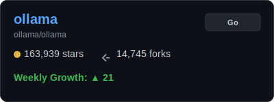
    </td>
    <td width="40%" style="vertical-align: top; text-align: center;">
      <a href="https://star-history.com/#ollama/ollama&Date">
        
      </a>
    </td>
  </tr>
</table>
<p align="right"><a href="#table-of-contents">🔼 Back to Top</a></p>


<table width="100%">
  <tr>
    <td width="60%" style="vertical-align: top;">
      <h3><a href="https://github.com/ggerganov/llama.cpp">llama.cpp</a> <sub>(Vault Mode)</sub></h3>
      <p>Port of Facebook's LLaMA model in C/C++ for efficient local inference</p>
      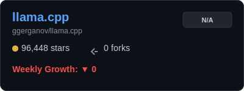
    </td>
    <td width="40%" style="vertical-align: top; text-align: center;">
      <a href="https://star-history.com/#ggerganov/llama.cpp&Date">
        
      </a>
    </td>
  </tr>
</table>
<p align="right"><a href="#table-of-contents">🔼 Back to Top</a></p>


<table width="100%">
  <tr>
    <td width="60%" style="vertical-align: top;">
      <h3><a href="https://github.com/vllm-project/vllm">vllm</a> <sub>(Vault Mode)</sub></h3>
      <p>A high-throughput and memory-efficient inference and serving engine for LLMs</p>
      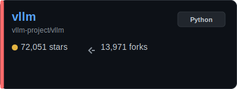
    </td>
    <td width="40%" style="vertical-align: top; text-align: center;">
      <a href="https://star-history.com/#vllm-project/vllm&Date">
        
      </a>
    </td>
  </tr>
</table>
<p align="right"><a href="#table-of-contents">🔼 Back to Top</a></p>


<table width="100%">
  <tr>
    <td width="60%" style="vertical-align: top;">
      <h3><a href="https://github.com/go-skynet/LocalAI">LocalAI</a> <sub>(Vault Mode)</sub></h3>
      <p>Self-hosted, community-driven, local OpenAI-compatible API</p>
      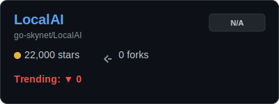
    </td>
    <td width="40%" style="vertical-align: top; text-align: center;">
      <a href="https://star-history.com/#go-skynet/LocalAI&Date">
        
      </a>
    </td>
  </tr>
</table>
<p align="right"><a href="#table-of-contents">🔼 Back to Top</a></p>


---

<h2 id='agents'>🛠️ AI Agents & Orchestration</h2>


<table width="100%">
  <tr>
    <td width="60%" style="vertical-align: top;">
      <h3><a href="https://github.com/Significant-Gravitas/AutoGPT">AutoGPT</a> <sub>(Vault Mode)</sub></h3>
      <p>An open-source interface for building and orchestrating autonomous AI agents</p>
      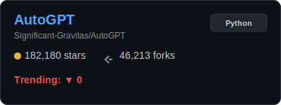
    </td>
    <td width="40%" style="vertical-align: top; text-align: center;">
      <a href="https://star-history.com/#Significant-Gravitas/AutoGPT&Date">
        
      </a>
    </td>
  </tr>
</table>
<p align="right"><a href="#table-of-contents">🔼 Back to Top</a></p>


<table width="100%">
  <tr>
    <td width="60%" style="vertical-align: top;">
      <h3><a href="https://github.com/joaomdmoura/crewAI">crewAI</a> <sub>(Vault Mode)</sub></h3>
      <p>Framework for orchestrating role-playing, autonomous AI agents</p>
      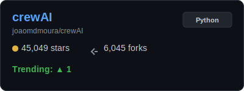
    </td>
    <td width="40%" style="vertical-align: top; text-align: center;">
      <a href="https://star-history.com/#joaomdmoura/crewAI&Date">
        
      </a>
    </td>
  </tr>
</table>
<p align="right"><a href="#table-of-contents">🔼 Back to Top</a></p>


<table width="100%">
  <tr>
    <td width="60%" style="vertical-align: top;">
      <h3><a href="https://github.com/langchain-ai/langgraph">langgraph</a> <sub>(Vault Mode)</sub></h3>
      <p>Build stateful, multi-actor applications with LLMs</p>
      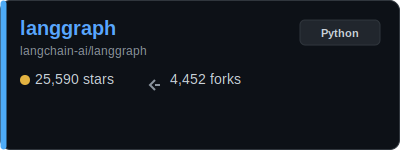
    </td>
    <td width="40%" style="vertical-align: top; text-align: center;">
      <a href="https://star-history.com/#langchain-ai/langgraph&Date">
        
      </a>
    </td>
  </tr>
</table>
<p align="right"><a href="#table-of-contents">🔼 Back to Top</a></p>


<table width="100%">
  <tr>
    <td width="60%" style="vertical-align: top;">
      <h3><a href="https://github.com/pydantic/pydantic-ai">pydantic-ai</a> <sub>(Vault Mode)</sub></h3>
      <p>Agent framework from the makers of Pydantic</p>
      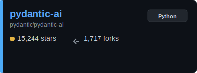
    </td>
    <td width="40%" style="vertical-align: top; text-align: center;">
      <a href="https://star-history.com/#pydantic/pydantic-ai&Date">
        
      </a>
    </td>
  </tr>
</table>
<p align="right"><a href="#table-of-contents">🔼 Back to Top</a></p>


---

<h2 id='cli_tools'>💻 AI-Powered CLI & DevTools</h2>


<table width="100%">
  <tr>
    <td width="60%" style="vertical-align: top;">
      <h3><a href="https://github.com/OpenInterpreter/open-interpreter">open-interpreter</a> <sub>(Vault Mode)</sub></h3>
      <p>A natural language interface for your computer</p>
      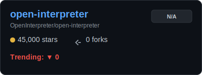
    </td>
    <td width="40%" style="vertical-align: top; text-align: center;">
      <a href="https://star-history.com/#OpenInterpreter/open-interpreter&Date">
        
      </a>
    </td>
  </tr>
</table>
<p align="right"><a href="#table-of-contents">🔼 Back to Top</a></p>


<table width="100%">
  <tr>
    <td width="60%" style="vertical-align: top;">
      <h3><a href="https://github.com/paul-gauthier/aider">aider</a> <sub>(Vault Mode)</sub></h3>
      <p>aider is AI pair programming in your terminal</p>
      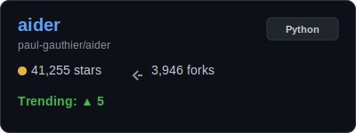
    </td>
    <td width="40%" style="vertical-align: top; text-align: center;">
      <a href="https://star-history.com/#paul-gauthier/aider&Date">
        
      </a>
    </td>
  </tr>
</table>
<p align="right"><a href="#table-of-contents">🔼 Back to Top</a></p>


<table width="100%">
  <tr>
    <td width="60%" style="vertical-align: top;">
      <h3><a href="https://github.com/Py-GPT/PyGPT">PyGPT</a> <sub>(Vault Mode)</sub></h3>
      <p>AI Desktop Assistant for Windows, Linux and Mac</p>
      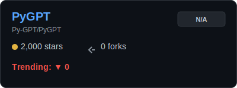
    </td>
    <td width="40%" style="vertical-align: top; text-align: center;">
      <a href="https://star-history.com/#Py-GPT/PyGPT&Date">
        
      </a>
    </td>
  </tr>
</table>
<p align="right"><a href="#table-of-contents">🔼 Back to Top</a></p>


---

<h2 id='art_vision'>🎨 Generative Art & Vision</h2>


<table width="100%">
  <tr>
    <td width="60%" style="vertical-align: top;">
      <h3><a href="https://github.com/AUTOMATIC1111/stable-diffusion-webui">stable-diffusion-webui</a> <sub>(Vault Mode)</sub></h3>
      <p>Comprehensive browser interface for Stable Diffusion models</p>
      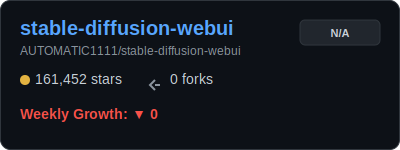
    </td>
    <td width="40%" style="vertical-align: top; text-align: center;">
      <a href="https://star-history.com/#AUTOMATIC1111/stable-diffusion-webui&Date">
        
      </a>
    </td>
  </tr>
</table>
<p align="right"><a href="#table-of-contents">🔼 Back to Top</a></p>


<table width="100%">
  <tr>
    <td width="60%" style="vertical-align: top;">
      <h3><a href="https://github.com/lllyasviel/Fooocus">Fooocus</a> <sub>(Vault Mode)</sub></h3>
      <p>Focus on prompting and generating images with SDXL</p>
      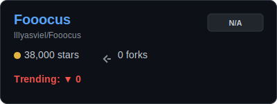
    </td>
    <td width="40%" style="vertical-align: top; text-align: center;">
      <a href="https://star-history.com/#lllyasviel/Fooocus&Date">
        
      </a>
    </td>
  </tr>
</table>
<p align="right"><a href="#table-of-contents">🔼 Back to Top</a></p>


<table width="100%">
  <tr>
    <td width="60%" style="vertical-align: top;">
      <h3><a href="https://github.com/comfyanonymous/ComfyUI">ComfyUI</a> <sub>(Vault Mode)</sub></h3>
      <p>The most powerful and modular stable diffusion GUI and backend</p>
      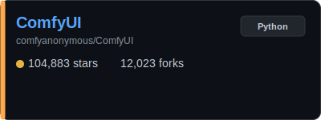
    </td>
    <td width="40%" style="vertical-align: top; text-align: center;">
      <a href="https://star-history.com/#comfyanonymous/ComfyUI&Date">
        
      </a>
    </td>
  </tr>
</table>
<p align="right"><a href="#table-of-contents">🔼 Back to Top</a></p>


---

<h2 id='frameworks'>🧠 Research & Core Frameworks</h2>


<table width="100%">
  <tr>
    <td width="60%" style="vertical-align: top;">
      <h3><a href="https://github.com/huggingface/transformers">transformers</a> <sub>(Vault Mode)</sub></h3>
      <p>State-of-the-art machine learning for PyTorch, TensorFlow, and JAX</p>
      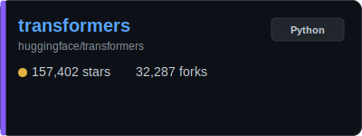
    </td>
    <td width="40%" style="vertical-align: top; text-align: center;">
      <a href="https://star-history.com/#huggingface/transformers&Date">
        
      </a>
    </td>
  </tr>
</table>
<p align="right"><a href="#table-of-contents">🔼 Back to Top</a></p>


<table width="100%">
  <tr>
    <td width="60%" style="vertical-align: top;">
      <h3><a href="https://github.com/langchain-ai/langchain">langchain</a> <sub>(Vault Mode)</sub></h3>
      <p>Framework for developing applications powered by language models with composable tools</p>
      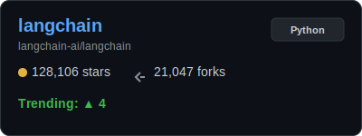
    </td>
    <td width="40%" style="vertical-align: top; text-align: center;">
      <a href="https://star-history.com/#langchain-ai/langchain&Date">
        
      </a>
    </td>
  </tr>
</table>
<p align="right"><a href="#table-of-contents">🔼 Back to Top</a></p>


<table width="100%">
  <tr>
    <td width="60%" style="vertical-align: top;">
      <h3><a href="https://github.com/run-llama/llama_index">llama_index</a> <sub>(Vault Mode)</sub></h3>
      <p>Data framework for your LLM applications</p>
      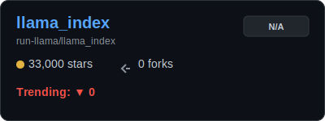
    </td>
    <td width="40%" style="vertical-align: top; text-align: center;">
      <a href="https://star-history.com/#run-llama/llama_index&Date">
        
      </a>
    </td>
  </tr>
</table>
<p align="right"><a href="#table-of-contents">🔼 Back to Top</a></p>


---


---

<h2 id="how-to-contribute">🤝 Join the AI Community & Contribute</h2>

We are looking for AI enthusiasts to help keep this dashboard the #1 source for AI trends! 🚀

<details>
<summary><b>🔥 How to Recommend a Trending AI Repo? (Click to Expand)</b></summary>
<br>

If you've found an AI repository that is blowing up, we want to know!
1. **Open `GitTrendHub/projects.json`**.
2. Find the relevant sub-category.
3. Add the repository in this format:
   ```json
   { "url_path": "OWNER/REPO", "last_stars": "0k+" }
   ```
4. Submit a **Pull Request** titled `AI-Recommend: OWNER/REPO`.
</details>

<details>
<summary><b>🛠️ How to Contribute to the Tooling? (Click to Expand)</b></summary>
<br>

Want to improve our custom SVG generator or README layouts?
1. **Fork** this repository.
2. Clone it locally.
3. Modify `GitTrendHub/update_readme.py` or the template.
4. Run locally to verify: `python3 GitTrendHub/update_readme.py`
5. Submit a **Pull Request**!
</details>

<br />

---

## 📝 Data Summary

Data is retrieved using the GitHub REST API and GitHub Actions.

<div align="right">
  <i>✨ Last Generated: March 03, 2026 - 16:06 UTC</i>
</div>
